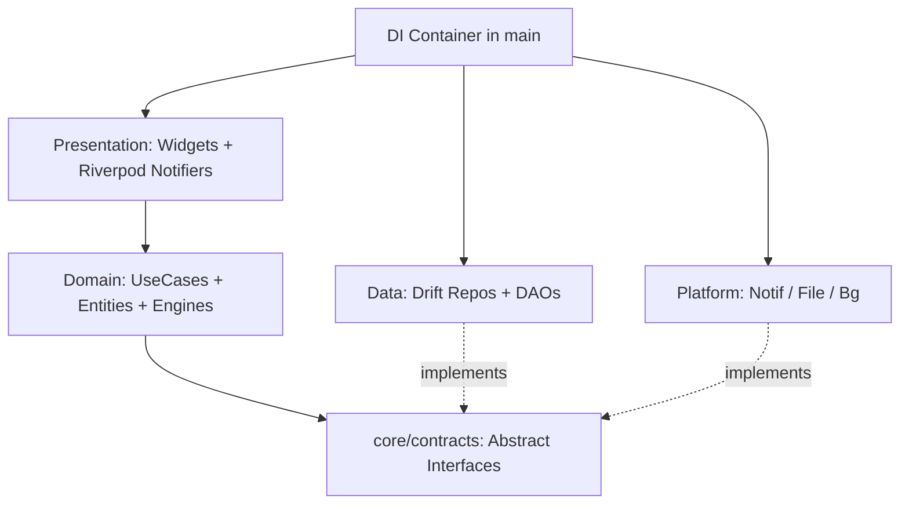
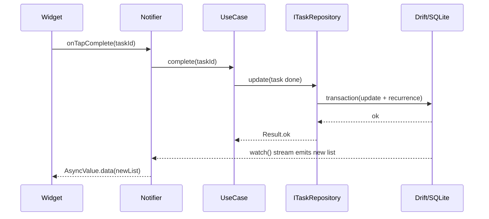

# 00 · 架构总览 / Architecture Overview

> 关联 / Related: [README](README.md) · [需求 proposal.md](../doc/proposal.md)

---

## 1. 架构风格 / Architecture Style

**中文：** 采用**分层 + 特性优先（feature-first）**混合架构，结合 Clean Architecture 的依赖反转原则。共四层：表现层（Presentation）、领域层（Domain）、数据层（Data）、平台层（Platform）。跨模块通信全部通过 `core/contracts` 中的抽象接口，依赖在 `main()` 通过 Riverpod 容器装配。

**English:** Layered + feature-first hybrid with Clean Architecture dependency inversion. Four layers: Presentation, Domain, Data, Platform. All cross-module communication flows through abstract interfaces in `core/contracts`; dependencies are wired via the Riverpod container in `main()`.



**关键规则 / Key rule:** `presentation` 与 `domain` 的源码**禁止** import `data/` 或 `platform/`。CI 用 import lint（如 `import_lint` 或自定义 `dart analyze` 规则）强制此边界。

---

## 2. 各层职责 / Layer Responsibilities

| 层 / Layer | 职责 / Responsibility | 允许依赖 / May depend on | 禁止依赖 / Must NOT depend on |
|---|---|---|---|
| Presentation | Widgets、路由、Riverpod Notifier/State、输入校验展示 | Domain, core/contracts, core/models | data, platform |
| Domain | 用例 UseCase、纯算法（重复引擎、提醒计算、筛选规格） | core/contracts, core/models | data, platform, Flutter UI |
| core/contracts | 抽象接口 + 数据契约（DTO/entity 引用） | core/models | 任何具体实现 |
| Data | Drift 数据库、DAO、Repository 实现、mapper | core/contracts, core/models | presentation |
| Platform | 通知、文件、后台调度等系统能力实现 | core/contracts, core/models | presentation, domain |

---

## 3. 状态管理 / State Management (Riverpod)

**选型 / Choice:** `flutter_riverpod` + `riverpod_generator`（编译期安全、易测试、可覆盖 Provider）。

### 3.1 Provider 分层 / Provider Layers

```dart
// 1) 基础设施 Provider（在 main 中 override 注入实现）
//    Infrastructure providers — overridden in main() with concrete impls
final taskRepositoryProvider = Provider<ITaskRepository>(
  (ref) => throw UnimplementedError('override in main'),
);
final notificationServiceProvider = Provider<INotificationService>(
  (ref) => throw UnimplementedError('override in main'),
);

// 2) 领域/用例 Provider（纯函数依赖注入）
//    Domain/usecase providers
final completeTaskUseCaseProvider = Provider<CompleteTaskUseCase>(
  (ref) => CompleteTaskUseCase(
    ref.watch(taskRepositoryProvider),
    ref.watch(reminderRepositoryProvider),
    RecurrenceEngine(),
  ),
);

// 3) 表现状态 Provider（AsyncNotifier 管理 UI 状态）
//    Presentation state providers
final taskListProvider =
    AsyncNotifierProvider<TaskListNotifier, List<TaskView>>(TaskListNotifier.new);
```

### 3.2 状态约定 / State Conventions

- 列表/异步数据用 `AsyncNotifier<T>` → UI 用 `AsyncValue.when(data/loading/error)`。
- 表单/本地交互状态用 `Notifier<T>`，提交时调用 UseCase。
- 跨模块数据变化通过 `ref.invalidate(provider)` 或 repository 暴露的 `Stream` 触发刷新（见 §6 数据流）。

---

## 4. 路由 / Routing (go_router)

**中文：** 桌面端与移动端复用同一套路由表，通过 `LayoutBuilder` 断点切换 Shell（桌面三栏 vs 移动底部导航）。

```dart
final router = GoRouter(
  initialLocation: '/tasks',
  routes: [
    ShellRoute(
      builder: (ctx, state, child) => AdaptiveScaffold(child: child),
      routes: [
        GoRoute(path: '/tasks', builder: (_, __) => const TaskListPage()),
        GoRoute(path: '/calendar', builder: (_, __) => const CalendarPage()),
        GoRoute(path: '/search', builder: (_, __) => const SearchPage()),
        GoRoute(path: '/settings', builder: (_, __) => const SettingsPage()),
        GoRoute(
          path: '/task/:id',
          builder: (_, s) => TaskDetailPage(taskId: s.pathParameters['id']!),
        ),
      ],
    ),
  ],
);
```

| 断点 / Breakpoint | 宽度 / Width | Shell |
|---|---|---|
| Compact (mobile) | < 600dp | 底部 NavigationBar + 全屏页 + FAB |
| Medium | 600–1024dp | NavigationRail + 单内容区 |
| Expanded (desktop) | > 1024dp | 侧边栏 + 内容区 + 右侧详情面板 |

`/task/:id` 在桌面端渲染为右侧详情面板（不压栈），在移动端为全屏页（压栈）。由 `AdaptiveScaffold` 判断。

---

## 5. 模块接口契约总表 / Module Contract Summary

**中文：** 这是模块独立性的核心。每个接口定义在 `core/contracts`，由 `data`/`platform` 实现，被 `domain`/`presentation` 消费。详细签名见各模块文档。

```dart
/// 任务仓储 / Task repository — 见 02 模块
abstract interface class ITaskRepository {
  Future<Result<Task>> create(TaskDraft draft);
  Future<Result<Task>> update(Task task);
  Future<Result<void>> delete(String id, {required bool entireSeries});
  Future<Result<Task?>> findById(String id);

  /// 区间查询：日历/甘特用 / range query for calendar & gantt
  Future<Result<List<Task>>> findInRange(DateTimeRange range, {TaskQuery? query});

  /// 任意条件查询：清单/搜索用 / arbitrary query for list & search
  Future<Result<List<Task>>> query(TaskQuery query);

  /// 响应式流：写操作后 UI 自动刷新 / reactive stream
  Stream<List<Task>> watch(TaskQuery query);
}

/// 项目仓储 / Project repository
abstract interface class IProjectRepository {
  Future<Result<List<Project>>> getAll();
  Future<Result<Project>> create(String name, {String? color});
  Future<Result<Project>> update(Project project);
  Future<Result<void>> delete(String id, {required ProjectDeleteMode mode});
  Stream<List<Project>> watchAll();
}

/// 标签仓储 / Tag repository
abstract interface class ITagRepository {
  Future<Result<List<Tag>>> getAll();
  Future<Result<Tag>> create(String name, {String? color});
  Future<Result<void>> delete(String id);
  Stream<List<Tag>> watchAll();
}

/// 提醒仓储 / Reminder repository — 见 05 模块
abstract interface class IReminderRepository {
  Future<Result<List<Reminder>>> getByTask(String taskId);
  Future<Result<void>> replaceForTask(String taskId, List<Reminder> reminders);
  Future<Result<List<Reminder>>> dueBefore(DateTime cutoff);
  Future<Result<void>> markFired(String reminderId);
}

/// 通知服务 / Notification service — 见 05 模块
abstract interface class INotificationService {
  Future<bool> requestPermission();
  Future<void> schedule(NotificationRequest request);
  Future<void> cancel(int notificationId);
  Future<void> cancelForTask(String taskId);
  Stream<NotificationAction> get onAction; // 用户点击通知动作
}

/// 设置存储 / Settings store — 见 06 模块
abstract interface class ISettingsStore {
  T get<T>(SettingKey<T> key);
  Future<void> set<T>(SettingKey<T> key, T value);
  Stream<AppSettings> watch();
}

/// 同步引擎（Phase 2 预留）/ Sync engine (reserved)
abstract interface class ISyncEngine {
  Future<Result<void>> push();
  Future<Result<void>> pull();
  Stream<SyncStatus> get status;
}
```

---

## 6. 数据流 / Data Flow

**写路径 / Write path:** UI 事件 → Notifier → UseCase → Repository(`create/update`) → Drift 事务 → 触发 `watch` Stream → 所有订阅的 Notifier 自动重建。

**读路径 / Read path:** Notifier `build()` → `repository.watch(query)` → 监听 Drift `Stream` → 映射为 UI 视图模型。



---

## 7. 错误处理 / Error Handling

```dart
/// 统一返回类型 / unified result type (sealed)
sealed class Result<T> {
  const Result();
}
class Ok<T> extends Result<T> {
  final T value;
  const Ok(this.value);
}
class Err<T> extends Result<T> {
  final AppException error;
  const Err(this.error);
}

/// 领域异常体系 / domain exception hierarchy
sealed class AppException implements Exception {
  final String code;
  final String messageKey; // i18n key
  const AppException(this.code, this.messageKey);
}
class ValidationException extends AppException { /* e.g. dueBeforeStart */ }
class NotFoundException extends AppException {}
class PersistenceException extends AppException {}
class PermissionException extends AppException { /* e.g. exactAlarmDenied */ }
```

- 数据/领域层**不抛裸异常**，统一封装为 `Result`。
- Presentation 层将 `Err` 映射为 SnackBar/对话框，用 `messageKey` 做 i18n。

---

## 8. 依赖注入装配 / DI Wiring (`main.dart`)

```dart
Future<void> main() async {
  WidgetsFlutterBinding.ensureInitialized();

  final db = AppDatabase(await openConnection());           // data
  final settings = await SharedPrefsSettingsStore.init();   // platform
  final notif = FlutterLocalNotificationService(db);        // platform

  runApp(
    ProviderScope(
      overrides: [
        appDatabaseProvider.overrideWithValue(db),
        taskRepositoryProvider.overrideWithValue(DriftTaskRepository(db)),
        projectRepositoryProvider.overrideWithValue(DriftProjectRepository(db)),
        tagRepositoryProvider.overrideWithValue(DriftTagRepository(db)),
        reminderRepositoryProvider.overrideWithValue(DriftReminderRepository(db)),
        notificationServiceProvider.overrideWithValue(notif),
        settingsStoreProvider.overrideWithValue(settings),
        // syncEngineProvider 预留：Phase 2 注入 RemoteSyncEngine
      ],
      child: const PlanListApp(),
    ),
  );
}
```

**测试替换 / Test substitution:** 测试中用同样的 `overrides` 注入 Fake/Mock，即可隔离任何上层模块（见 [07-testing-strategy.md](07-testing-strategy.md)）。

---

## 9. 关键全局约定 / Global Conventions

| 主题 / Topic | 约定 / Convention |
|---|---|
| ID | `String` UUID v4（`uuid` 包），全局唯一，利于同步 |
| 时间存储 / Time storage | UTC 毫秒 `INTEGER`；entity 内为 `DateTime`(UTC) |
| 时间展示 / Time display | UI 转本地时区 + `intl` 按 locale 格式化 |
| 不可变模型 / Immutability | `freezed` + `copyWith` |
| 序列化 / Serialization | `json_serializable`（同步与导入导出用） |
| 代码生成 / Codegen | `build_runner`（drift/freezed/riverpod/json） |
| Lint | `flutter_lints` + 自定义分层 import 规则 |
