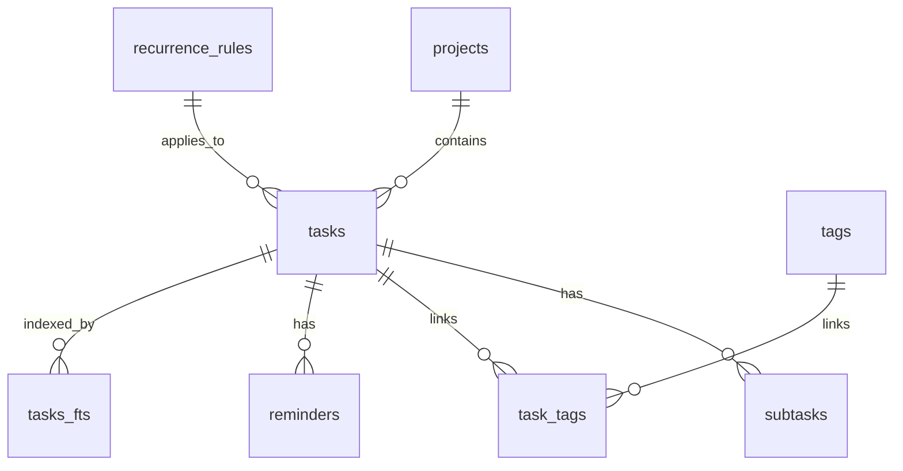

# 01 · 数据与持久化 / Data & Persistence

> 关联 / Related: [README](README.md) · [00 架构](00-architecture-overview.md) · [需求 §4 数据模型](../doc/proposal.md)

---

## 1. 职责 / Responsibility

**中文：** 提供本地优先的持久化能力，实现 `core/contracts` 中所有仓储接口。包含 Drift 表定义、DDL、DAO、Repository 实现、row↔entity 映射、FTS5 全文索引、数据库迁移与 Phase 2 同步字段。该模块是唯一允许直接接触 SQLite 的地方。

**English:** Provides local-first persistence and implements all repository contracts. Owns Drift tables, DDL, DAOs, repository implementations, row↔entity mapping, FTS5 index, migrations, and reserved sync fields. The only module permitted to touch SQLite directly.

**依赖 / Depends on:** `core/contracts`, `core/models`. **被依赖 / Used by:** DI 容器（注入到上层）。

---

## 2. 技术选型 / Tech Choice

| 项 / Item | 选择 / Choice | 理由 / Rationale |
|---|---|---|
| ORM | `drift` | 类型安全、编译期校验 SQL、内置响应式 `Stream`、支持 FTS5 |
| 引擎 / Engine | `sqlite3` (FFI, `drift/native`) | Windows + Android 一致；性能好 |
| 全文搜索 / FTS | SQLite **FTS5** 虚拟表 | 标题+备注全文检索 |
| 路径 / Path | `path_provider` | 跨平台数据库文件位置 |
| ID | `uuid` v4 | 全局唯一，利于同步 |

---

## 3. 表结构与 DDL / Schema & DDL

### 3.1 ER 复述 / ER Recap



### 3.2 DDL / SQL

```sql
-- 项目 / projects
CREATE TABLE projects (
  id            TEXT PRIMARY KEY,
  name          TEXT NOT NULL,
  color         TEXT,                 -- #RRGGBB
  sort_order    INTEGER NOT NULL DEFAULT 0,
  created_at    INTEGER NOT NULL,     -- UTC epoch ms
  updated_at    INTEGER NOT NULL,
  -- 同步预留 / sync reserved
  deleted_at    INTEGER,
  sync_version  INTEGER NOT NULL DEFAULT 0,
  device_id     TEXT
);

-- 重复规则 / recurrence_rules
CREATE TABLE recurrence_rules (
  id            TEXT PRIMARY KEY,
  frequency     INTEGER NOT NULL,     -- 0 DAILY 1 WEEKLY 2 MONTHLY 3 CUSTOM
  interval      INTEGER NOT NULL DEFAULT 1,
  byweekday     TEXT,                 -- JSON array, e.g. [1,3,5] (Mon/Wed/Fri)
  by_month_day  INTEGER,             -- for MONTHLY, day-of-month
  end_date      INTEGER,             -- nullable: never-ending
  count         INTEGER              -- nullable: max occurrences
);

-- 任务 / tasks
CREATE TABLE tasks (
  id                 TEXT PRIMARY KEY,
  project_id         TEXT REFERENCES projects(id) ON DELETE SET NULL,
  title              TEXT NOT NULL,
  notes              TEXT,
  start_date         INTEGER,         -- UTC ms, nullable
  due_date           INTEGER,         -- UTC ms, nullable
  created_at         INTEGER NOT NULL,
  completed_at       INTEGER,         -- set when completed
  priority           INTEGER NOT NULL DEFAULT 2, -- 0 H 1 M 2 L
  is_completed       INTEGER NOT NULL DEFAULT 0,  -- 0/1 (status persisted; OVERDUE derived)
  sort_order         INTEGER NOT NULL DEFAULT 0,
  recurrence_rule_id TEXT REFERENCES recurrence_rules(id) ON DELETE SET NULL,
  recurrence_parent  TEXT,            -- template/series id for generated instances
  auto_complete_on_subtasks INTEGER NOT NULL DEFAULT 0,
  -- 同步预留 / sync reserved
  updated_at         INTEGER NOT NULL,
  deleted_at         INTEGER,
  sync_version       INTEGER NOT NULL DEFAULT 0,
  device_id          TEXT,
  CHECK (due_date IS NULL OR start_date IS NULL OR due_date >= start_date)
);

-- 子任务 / subtasks
CREATE TABLE subtasks (
  id          TEXT PRIMARY KEY,
  task_id     TEXT NOT NULL REFERENCES tasks(id) ON DELETE CASCADE,
  title       TEXT NOT NULL,
  is_done     INTEGER NOT NULL DEFAULT 0,
  sort_order  INTEGER NOT NULL DEFAULT 0
);

-- 标签 / tags
CREATE TABLE tags (
  id     TEXT PRIMARY KEY,
  name   TEXT NOT NULL UNIQUE,
  color  TEXT
);

-- 任务-标签关联 / task_tags (M2M)
CREATE TABLE task_tags (
  task_id  TEXT NOT NULL REFERENCES tasks(id) ON DELETE CASCADE,
  tag_id   TEXT NOT NULL REFERENCES tags(id)  ON DELETE CASCADE,
  PRIMARY KEY (task_id, tag_id)
);

-- 提醒 / reminders
CREATE TABLE reminders (
  id          TEXT PRIMARY KEY,
  task_id     TEXT NOT NULL REFERENCES tasks(id) ON DELETE CASCADE,
  trigger_at  INTEGER NOT NULL,       -- absolute UTC ms (computed)
  type        INTEGER NOT NULL,       -- 0 BEFORE_DUE 1 AT_START 2 CUSTOM 3 OVERDUE
  offset_min  INTEGER,                -- for BEFORE_DUE: minutes before due
  is_fired    INTEGER NOT NULL DEFAULT 0,
  notif_id    INTEGER                 -- platform notification id (int) for cancel
);

-- 全文搜索 / FTS5 (external content over tasks)
CREATE VIRTUAL TABLE tasks_fts USING fts5(
  title,
  notes,
  content='tasks',
  content_rowid='rowid'
);
```

### 3.3 索引 / Indexes

```sql
CREATE INDEX idx_task_due        ON tasks(due_date);
CREATE INDEX idx_task_start      ON tasks(start_date);
CREATE INDEX idx_task_completed  ON tasks(is_completed);
CREATE INDEX idx_task_project    ON tasks(project_id);
CREATE INDEX idx_task_deleted    ON tasks(deleted_at);
CREATE INDEX idx_reminder_trig   ON reminders(trigger_at, is_fired);
CREATE INDEX idx_subtask_task    ON subtasks(task_id, sort_order);
```

### 3.4 FTS 同步触发器 / FTS Sync Triggers

```sql
CREATE TRIGGER tasks_ai AFTER INSERT ON tasks BEGIN
  INSERT INTO tasks_fts(rowid, title, notes) VALUES (new.rowid, new.title, new.notes);
END;
CREATE TRIGGER tasks_ad AFTER DELETE ON tasks BEGIN
  INSERT INTO tasks_fts(tasks_fts, rowid, title, notes) VALUES('delete', old.rowid, old.title, old.notes);
END;
CREATE TRIGGER tasks_au AFTER UPDATE ON tasks BEGIN
  INSERT INTO tasks_fts(tasks_fts, rowid, title, notes) VALUES('delete', old.rowid, old.title, old.notes);
  INSERT INTO tasks_fts(rowid, title, notes) VALUES (new.rowid, new.title, new.notes);
END;
```

> **CJK 分词 / Chinese tokenization:** FTS5 默认按西文分词，对中文需要 `unicode61` + n-gram 处理。Phase 1 方案：建表时用 `tokenize = 'unicode61'` 并在查询层对中文关键词做 **2-gram 切分**后用 `OR` 拼接（见 [04 搜索模块](04-search-filter-module.md) §4）。若效果不足，Phase 2 评估 `simple`/ICU tokenizer。

---

## 4. Drift 表定义 / Drift Table Classes

```dart
// data/db/tables.dart
import 'package:drift/drift.dart';

class Tasks extends Table {
  TextColumn get id => text()();
  TextColumn get projectId => text().nullable().references(Projects, #id)();
  TextColumn get title => text()();
  TextColumn get notes => text().nullable()();
  IntColumn  get startDate => integer().nullable()();   // UTC ms
  IntColumn  get dueDate => integer().nullable()();
  IntColumn  get createdAt => integer()();
  IntColumn  get completedAt => integer().nullable()();
  IntColumn  get priority => integer().withDefault(const Constant(2))();
  BoolColumn get isCompleted => boolean().withDefault(const Constant(false))();
  IntColumn  get sortOrder => integer().withDefault(const Constant(0))();
  TextColumn get recurrenceRuleId =>
      text().nullable().references(RecurrenceRules, #id)();
  TextColumn get recurrenceParent => text().nullable()();
  BoolColumn get autoCompleteOnSubtasks =>
      boolean().withDefault(const Constant(false))();
  IntColumn  get updatedAt => integer()();
  IntColumn  get deletedAt => integer().nullable()();
  IntColumn  get syncVersion => integer().withDefault(const Constant(0))();
  TextColumn get deviceId => text().nullable()();

  @override
  Set<Column> get primaryKey => {id};
}

// Projects / Subtasks / Tags / TaskTags / Reminders / RecurrenceRules 同理省略
// (analogous classes omitted for brevity)

@DriftDatabase(
  tables: [Tasks, Projects, Subtasks, Tags, TaskTags, Reminders, RecurrenceRules],
  daos: [TaskDao, ProjectDao, TagDao, ReminderDao],
)
class AppDatabase extends _$AppDatabase {
  AppDatabase(super.e);
  @override
  int get schemaVersion => 1;

  @override
  MigrationStrategy get migration => MigrationStrategy(
        onCreate: (m) async {
          await m.createAll();
          await customStatement(_createFtsSql);     // FTS table + triggers
          await _seedDefaultProject(this);          // “收件箱 / Inbox”
        },
        onUpgrade: (m, from, to) async {
          // 见 §7 迁移策略
        },
        beforeOpen: (details) async {
          await customStatement('PRAGMA foreign_keys = ON');
        },
      );
}
```

---

## 5. DAO 设计 / DAO Design

**中文：** DAO 封装具体 SQL，返回 Drift row 类型；Repository 调用 DAO 并做 row↔entity 映射、事务编排。DAO 与 Repository 分离便于针对复杂查询单测。

```dart
// data/db/task_dao.dart
@DriftAccessor(tables: [Tasks, Subtasks, TaskTags, Tags, Reminders])
class TaskDao extends DatabaseAccessor<AppDatabase> with _$TaskDaoMixin {
  TaskDao(super.db);

  /// 区间查询（与 [start,due] 有交集，且未软删除）
  /// range overlap query for calendar & gantt
  Stream<List<TaskRow>> watchInRange(int fromMs, int toMs) {
    return (select(tasks)
          ..where((t) =>
              t.deletedAt.isNull() &
              t.startDate.isSmallerOrEqualValue(toMs) &
              (t.dueDate.isBiggerOrEqualValue(fromMs) | t.dueDate.isNull()))
          ..orderBy([(t) => OrderingTerm(expression: t.startDate)]))
        .watch();
  }

  /// 动态条件查询（清单/筛选用）；TaskQuery -> WHERE 由 QueryBuilder 生成
  Selectable<TaskRow> buildQuery(TaskQuery q) { /* 见 04 模块 */ }

  /// 全文搜索 join
  Future<List<TaskRow>> searchFts(String matchExpr) {
    return customSelect(
      'SELECT t.* FROM tasks t '
      'JOIN tasks_fts f ON f.rowid = t.rowid '
      'WHERE tasks_fts MATCH ?1 AND t.deleted_at IS NULL '
      'ORDER BY rank',
      variables: [Variable.withString(matchExpr)],
      readsFrom: {tasks},
    ).map((r) => tasks.map(r.data)).get();
  }

  Future<void> upsertWithRelations(TaskWriteModel m) async {
    await transaction(() async {
      await into(tasks).insertOnConflictUpdate(m.taskRow);
      await (delete(taskTags)..where((tt) => tt.taskId.equals(m.taskRow.id))).go();
      await batch((b) => b.insertAll(taskTags, m.tagLinks));
      // subtasks / reminders 同理 upsert
    });
  }
}
```

---

## 6. Repository 实现 / Repository Implementations

```dart
// data/repositories/drift_task_repository.dart
class DriftTaskRepository implements ITaskRepository {
  DriftTaskRepository(this._db) : _dao = _db.taskDao;
  final AppDatabase _db;
  final TaskDao _dao;

  @override
  Future<Result<Task>> create(TaskDraft draft) async {
    try {
      final entity = TaskMapper.fromDraft(draft, now: DateTime.now().toUtc());
      await _dao.upsertWithRelations(TaskMapper.toWriteModel(entity));
      return Ok(entity);
    } on Exception catch (e) {
      return Err(PersistenceException.from(e));
    }
  }

  @override
  Stream<List<Task>> watch(TaskQuery query) =>
      _dao.buildQuery(query).watch().map(
            (rows) => rows.map(TaskMapper.toEntity).toList(),
          );

  @override
  Future<Result<List<Task>>> findInRange(DateTimeRange range, {TaskQuery? query}) async {
    final rows = await _dao
        .watchInRange(range.start.msUtc, range.end.msUtc)
        .first;
    return Ok(rows.map(TaskMapper.toEntity).toList());
  }
  // update / delete / findById / query ... 略
}
```

**映射层 / Mapper:** `data/mappers/task_mapper.dart` 负责 `TaskRow ↔ Task(entity)`、组合 subtasks/tags/reminders、UTC ms ↔ `DateTime`。Mapper 为纯函数，可单测。

---

## 7. 迁移策略 / Migration Strategy

| 版本 / Version | 变更 / Change |
|---|---|
| v1 | 初始 schema（本设计）/ initial schema |
| vN (Phase 2) | 启用同步：填充 `sync_version`、`device_id`；新增 `sync_meta` 表 |

- 每次结构变更 `schemaVersion++`，在 `onUpgrade` 写明确迁移步骤。
- 使用 drift 的 `schema dump` + `drift_dev schema generate` 做**迁移测试**（对每个版本跳变生成 fixture 并验证）。
- 破坏性变更前先 `VACUUM INTO` 备份数据库文件。

---

## 8. 软删除与默认数据 / Soft Delete & Seed

- **软删除 / Soft delete:** 所有删除写 `deleted_at`（同步友好）；查询默认 `deleted_at IS NULL`。物理清理由后台维护任务定期 `VACUUM`（仅清理超过保留期的记录）。
- **默认项目 / Default project:** 首次建库 seed 一个「收件箱 / Inbox」项目，未指定 `project_id` 的任务归入。

---

## 9. 性能要点 / Performance Notes

| 目标 / Target | 措施 / Measure |
|---|---|
| 月视图 < 500ms | `idx_task_due` + `idx_task_start` 命中区间查询；只取可视范围 |
| 1000 任务 60fps | Drift `Stream` 增量 + UI `ListView.builder` 懒加载 |
| 搜索 < 300ms | FTS5 `rank` 排序 + 查询防抖（04 模块） |
| 写入原子 | 所有多表写入包在 `transaction` |

---

## 10. 测试钩子 / Testing Hooks

- 用 `NativeDatabase.memory()` 建**内存数据库**跑 DAO/Repository 单测，无需文件。
- Mapper 纯函数直接单测。
- 见 [07 测试策略](07-testing-strategy.md) §3。

```dart
AppDatabase newTestDb() => AppDatabase(NativeDatabase.memory());
```
