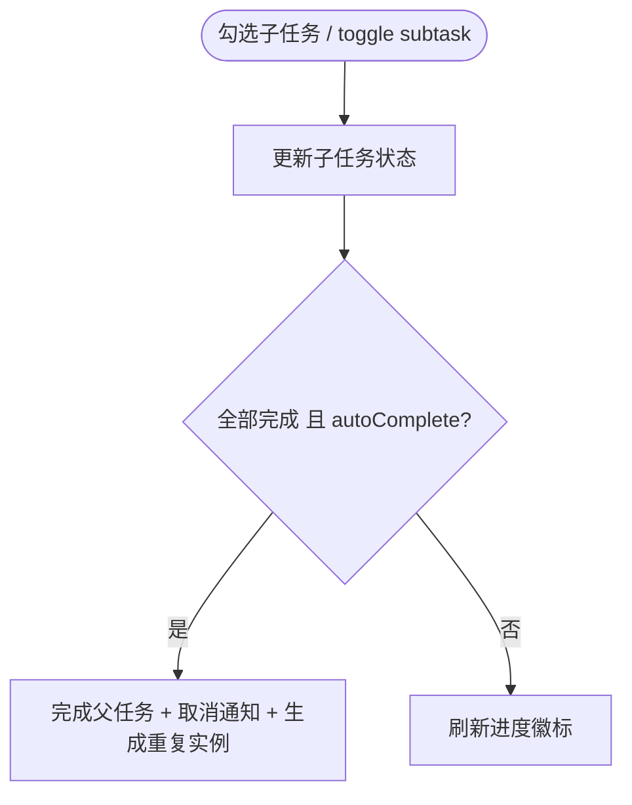

# 02 · 任务模块 / Task Module

> 关联 / Related: [README](README.md) · [00 架构](00-architecture-overview.md) · [01 数据](01-data-and-persistence.md) · [需求 §3.1](../doc/proposal.md)

---

## 1. 职责 / Responsibility

**中文：** 任务的领域核心：任务/子任务的领域模型、创建/编辑/完成/删除用例、状态派生（逾期）、重复任务生成引擎、自动完成逻辑，以及清单视图的状态管理（Provider）与 UI 交互。仅依赖 `core/contracts`（仓储接口），不接触数据库。

**English:** Domain core for tasks: entities for task/subtask, create/edit/complete/delete use cases, derived status (overdue), recurrence generation engine, auto-complete logic, plus list-view state management and UI. Depends only on repository contracts.

**依赖 / Depends on:** `ITaskRepository`, `IProjectRepository`, `ITagRepository`, `IReminderRepository`(写提醒), `RecurrenceEngine`(自有领域服务)。

---

## 2. 领域模型 / Domain Models

```dart
// core/models/task.dart  (freezed, immutable)
@freezed
class Task with _$Task {
  const factory Task({
    required String id,
    required String title,
    String? notes,
    String? projectId,
    DateTime? startDate,          // UTC
    DateTime? dueDate,            // UTC, >= startDate
    required DateTime createdAt,  // auto, read-only
    DateTime? completedAt,        // auto on complete
    @Default(Priority.low) Priority priority,
    @Default(false) bool isCompleted,
    @Default(<Subtask>[]) List<Subtask> subtasks,
    @Default(<Tag>[]) List<Tag> tags,
    RecurrenceRule? recurrence,
    String? recurrenceParent,
    @Default(false) bool autoCompleteOnSubtasks,
    @Default(<Reminder>[]) List<Reminder> reminders,
    @Default(0) int sortOrder,
  }) = _Task;
  const Task._();

  /// 派生状态 / derived status (OVERDUE 不入库, 实时计算)
  TaskStatus statusAt(DateTime now) {
    if (isCompleted) return TaskStatus.complete;
    if (dueDate != null && now.isAfter(dueDate!)) return TaskStatus.overdue;
    return TaskStatus.incomplete;
  }

  double get subtaskProgress =>
      subtasks.isEmpty ? 0 : subtasks.where((s) => s.isDone).length / subtasks.length;

  bool get isRecurring => recurrence != null;
}

@freezed
class Subtask with _$Subtask {
  const factory Subtask({
    required String id,
    required String title,
    @Default(false) bool isDone,
    @Default(0) int sortOrder,
  }) = _Subtask;
}

/// 新建草稿（无 id/创建时间，由仓储补全）/ create draft
@freezed
class TaskDraft with _$TaskDraft {
  const factory TaskDraft({
    required String title,
    String? notes,
    String? projectId,
    DateTime? startDate,
    DateTime? dueDate,
    @Default(Priority.low) Priority priority,
    @Default(<String>[]) List<String> tagIds,
    @Default(<SubtaskDraft>[]) List<SubtaskDraft> subtasks,
    RecurrenceRule? recurrence,
    @Default(<ReminderDraft>[]) List<ReminderDraft> reminders,
    @Default(false) bool autoCompleteOnSubtasks,
  }) = _TaskDraft;
}
```

### 枚举 / Enums

```dart
enum Priority { high, medium, low }              // index 0/1/2 ↔ DB
enum TaskStatus { incomplete, complete, overdue } // overdue 派生
```

---

## 3. 用例 / Use Cases

每个用例是单一职责类，输入领域类型，输出 `Result`，便于单测。

| 用例 / UseCase | 输入 / Input | 行为 / Behavior |
|---|---|---|
| `CreateTaskUseCase` | `TaskDraft` | 校验日期 → 写任务 → 计算并写提醒 → 请求调度通知 |
| `UpdateTaskUseCase` | `Task` | 校验 → 更新 → 重算提醒 → 重新调度通知 |
| `CompleteTaskUseCase` | `taskId` | 写 `completedAt` → 取消通知 → 若重复则生成下一实例 |
| `ToggleSubtaskUseCase` | `taskId, subtaskId` | 切换 → 若全完成且 `autoComplete` 则完成父任务 |
| `DeleteTaskUseCase` | `taskId, scope` | 单次 / 整个系列软删除 → 取消通知 |
| `ReorderTasksUseCase` | `List<id>` | 批量更新 `sortOrder` |

```dart
// features/task/domain/complete_task_usecase.dart
class CompleteTaskUseCase {
  CompleteTaskUseCase(this._tasks, this._reminders, this._notif, this._engine);
  final ITaskRepository _tasks;
  final IReminderRepository _reminders;
  final INotificationService _notif;
  final RecurrenceEngine _engine;

  Future<Result<void>> call(String taskId, {DateTime? at}) async {
    final found = await _tasks.findById(taskId);
    if (found case Err(:final error)) return Err(error);
    final task = (found as Ok<Task?>).value;
    if (task == null) return Err(const NotFoundException());

    final now = (at ?? DateTime.now()).toUtc();
    final completed = task.copyWith(isCompleted: true, completedAt: now);

    final saved = await _tasks.update(completed);
    if (saved case Err(:final error)) return Err(error);

    await _notif.cancelForTask(taskId);              // 取消未触发通知

    if (task.isRecurring) {                          // 生成下一实例
      final next = _engine.nextInstance(task, after: now);
      if (next != null) {
        final created = await _tasks.create(next);
        if (created case Ok(:final value)) {
          await _scheduleReminders(value);
        }
      }
    }
    return const Ok(null);
  }
}
```

---

## 4. 重复任务引擎 / Recurrence Engine

**中文：** 纯函数领域服务，无 IO，输入当前任务与基准时间，输出下一实例草稿或 `null`（系列结束）。Phase 1 支持 DAILY / WEEKLY(byweekday) / MONTHLY(byMonthDay)；CUSTOM 预留。

```dart
// features/task/domain/recurrence_engine.dart
class RecurrenceEngine {
  /// 计算下一次发生日期 / next occurrence date
  DateTime? nextDate(RecurrenceRule rule, DateTime from) {
    DateTime candidate;
    switch (rule.frequency) {
      case RecurrenceFrequency.daily:
        candidate = from.add(Duration(days: rule.interval));
      case RecurrenceFrequency.weekly:
        candidate = _nextWeekday(from, rule.byWeekday, rule.interval);
      case RecurrenceFrequency.monthly:
        candidate = _addMonths(from, rule.interval, rule.byMonthDay);
      case RecurrenceFrequency.custom:
        candidate = from.add(Duration(days: rule.interval)); // 占位
    }
    if (rule.endDate != null && candidate.isAfter(rule.endDate!)) return null;
    return candidate;
  }

  /// 生成下一任务实例（保留属性，平移日期，重置完成态）
  TaskDraft? nextInstance(Task task, {required DateTime after}) {
    final rule = task.recurrence;
    if (rule == null) return null;
    final base = task.dueDate ?? task.startDate ?? after;
    final nextDue = nextDate(rule, base);
    if (nextDue == null) return null;
    final delta = task.dueDate != null && task.startDate != null
        ? task.dueDate!.difference(task.startDate!)
        : Duration.zero;
    return TaskDraft(
      title: task.title,
      notes: task.notes,
      projectId: task.projectId,
      startDate: nextDue.subtract(delta),
      dueDate: nextDue,
      priority: task.priority,
      recurrence: rule,
      tagIds: task.tags.map((t) => t.id).toList(),
      subtasks: task.subtasks
          .map((s) => SubtaskDraft(title: s.title))   // 重置完成态
          .toList(),
      reminders: task.reminders.map(ReminderDraft.fromTemplate).toList(),
    );
  }
}
```

**边界情况 / Edge cases:**
- 月底日期（1/31 → 2 月）：`byMonthDay` 超出当月则取当月最后一天。
- `count`/`endDate` 任一满足即停止。
- 「修改单次 vs 整个系列」：单次只改当前实例；整个系列改 `recurrence_rule` 并标记从某实例起生效。

---

## 5. 校验规则 / Validation

| 规则 / Rule | 错误 / Error |
|---|---|
| `title` 非空 | `ValidationException('emptyTitle')` |
| `dueDate >= startDate` | `ValidationException('dueBeforeStart')` |
| 提醒时间不晚于其锚点（如 BEFORE_DUE 的 offset>0） | `ValidationException('invalidReminder')` |

校验放在 UseCase 入口，UI 也做即时前置校验提升体验，但**领域层是最终权威**。

---

## 6. 状态管理 / State Management

```dart
// features/task/presentation/task_list_notifier.dart
@riverpod
class TaskListNotifier extends _$TaskListNotifier {
  @override
  Stream<List<TaskView>> build(TaskListScope scope) {
    final repo = ref.watch(taskRepositoryProvider);
    final now = ref.watch(clockProvider); // 可注入时钟，便于测试
    return repo.watch(scope.toQuery()).map(
          (tasks) => tasks.map((t) => TaskView.from(t, now)).toList(),
        );
  }

  Future<void> complete(String id) =>
      ref.read(completeTaskUseCaseProvider).call(id).asNotifier(ref);

  Future<void> toggleSubtask(String taskId, String subId) =>
      ref.read(toggleSubtaskUseCaseProvider).call(taskId, subId).asNotifier(ref);
}
```

- `TaskView`：表现层视图模型（含派生 `statusLabel`、`isOverdue`、`subtaskBadge`、本地化日期字符串）。
- `TaskListScope`：枚举/封装清单上下文（项目、标签、今天、逾期、已完成），转换为 `TaskQuery`（见 04 模块）。
- 注入 `clockProvider` 让「逾期」可测（测试中冻结时间）。

---

## 7. UI 结构 / UI Structure

| 组件 / Widget | 平台差异 / Platform |
|---|---|
| `TaskListPage` | 桌面：顶部快速输入框 + Enter；移动：底部 FAB + bottom sheet |
| `TaskTile` | 复选框 + 标题 + 优先级点 + 日期范围 + 子任务进度徽标；移动端支持左滑完成 |
| `TaskDetailPanel` / `TaskDetailPage` | 桌面右侧面板；移动全屏（路由 `/task/:id`） |
| `QuickAddBar` | 解析自然语言日期（可选增强，Phase 1 简单 DatePicker） |
| `RecurrencePicker` | 频率 + 间隔 + byweekday/monthday + 结束条件 |

详情页字段区块对应需求 §5.4：标题、日期、属性、子任务、提醒、重复、备注、只读元信息。

---

## 8. 关键交互 / Key Interactions



---

## 9. 测试策略 / Testing

| 层 / Layer | 测试 / Tests |
|---|---|
| 领域 / Domain | `RecurrenceEngine` 各频率/边界；用例用 Fake repo 验证副作用顺序（完成→取消通知→生成实例） |
| 校验 / Validation | 非法日期、空标题返回正确 `Err` |
| 状态 / State | `TaskListNotifier` 用注入的 in-memory repo + 冻结 `clockProvider` 验证逾期派生 |
| Widget | `TaskTile` golden（正常/逾期/已完成三态） |

```dart
test('completing recurring task creates next instance', () async {
  final repo = FakeTaskRepository()..seed(weeklyTask);
  final notif = SpyNotificationService();
  final uc = CompleteTaskUseCase(repo, FakeReminderRepo(), notif, RecurrenceEngine());

  await uc('task-1', at: DateTime.utc(2026, 6, 7));

  expect(repo.items.where((t) => !t.isCompleted), hasLength(1)); // next instance
  expect(notif.cancelledTaskIds, contains('task-1'));
});
```
