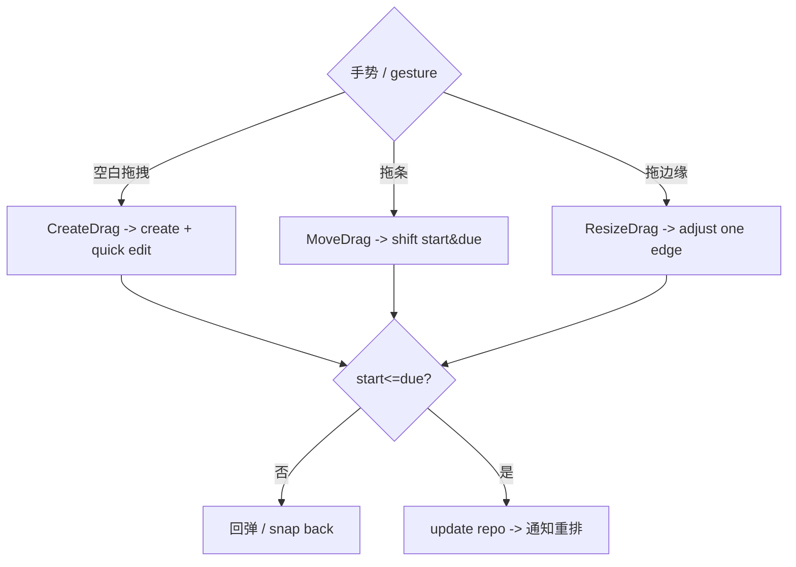

# 03 · 日历与甘特模块 / Calendar & Gantt Module

> 关联 / Related: [README](README.md) · [02 任务](02-task-module.md) · [需求 §3.2](../doc/proposal.md)

---

## 1. 职责 / Responsibility

**中文：** 以日 / 周 / 月 / 甘特四种视图展示任务，处理区间查询、布局算法（行分配、重叠避免）、拖拽交互（创建/平移/调整边缘），以及视图间共享的日期窗口状态。仅依赖 `ITaskRepository`（区间查询与更新），复用 02 模块的 `Task` 实体与更新用例。

**English:** Renders tasks in Day/Week/Month/Gantt views; handles range queries, layout algorithms (row assignment, overlap avoidance), drag interactions (create/move/resize), and a shared date-window state. Depends on `ITaskRepository` and reuses Task entity + update use cases from module 02.

---

## 2. 视图模型 / View Models

```dart
/// 当前视图状态 / current calendar view state
@freezed
class CalendarViewState with _$CalendarViewState {
  const factory CalendarViewState({
    required CalendarViewType type,   // day | week | month | gantt
    required DateTime anchor,         // 当前窗口锚点日期 (本地)
    required DateTimeRange visibleRange, // 派生：当前可见区间
    String? selectedTaskId,
  }) = _CalendarViewState;
}

enum CalendarViewType { day, week, month, gantt }

/// 甘特/时间轴中单个任务条的布局信息 / laid-out bar
@freezed
class TaskBar with _$TaskBar {
  const factory TaskBar({
    required Task task,
    required DateTime barStart,   // = startDate ?? dueDate
    required DateTime barEnd,     // = dueDate ?? startDate
    required int rowIndex,        // 分配的行（避免重叠）
    required bool isOverdue,
    required Color color,
  }) = _TaskBar;
}
```

---

## 3. 区间查询 / Range Query

**中文：** 各视图根据 `visibleRange` 调用统一区间查询；只取与窗口有交集的任务，避免全量加载。

```dart
@riverpod
Stream<List<TaskBar>> visibleBars(VisibleBarsRef ref) {
  final view = ref.watch(calendarViewStateProvider);
  final repo = ref.watch(taskRepositoryProvider);
  final colorMode = ref.watch(barColorModeProvider); // project | priority
  final now = ref.watch(clockProvider);

  // 交集判定：task.start <= range.end && (task.due >= range.start || due null)
  return repo
      .watch(TaskQuery.rangeOverlap(view.visibleRange))
      .map((tasks) => GanttLayout.assign(
            tasks,
            range: view.visibleRange,
            now: now,
            colorMode: colorMode,
          ));
}
```

**单日回退 / Single-day fallback:** 仅有 `dueDate`、无 `startDate` 时，`barStart = barEnd = dueDate`（需求 §3.2.2）。在 `GanttLayout` 中归一化。

---

## 4. 布局算法 / Layout Algorithm

**中文：** 甘特/周视图需将可能重叠的任务条分配到不同行（贪心区间调度）。

```dart
class GanttLayout {
  /// 贪心行分配：按 barStart 排序，逐个放入第一条不冲突的行
  /// Greedy lane assignment
  static List<TaskBar> assign(
    List<Task> tasks, {
    required DateTimeRange range,
    required DateTime now,
    required BarColorMode colorMode,
  }) {
    final normalized = tasks.map(_normalize).toList()
      ..sort((a, b) => a.start.compareTo(b.start));
    final laneEnds = <DateTime>[]; // 每行当前占用到的结束时间
    final bars = <TaskBar>[];
    for (final t in normalized) {
      int lane = laneEnds.indexWhere((end) => !t.start.isBefore(end));
      if (lane == -1) { lane = laneEnds.length; laneEnds.add(t.end); }
      else { laneEnds[lane] = t.end; }
      bars.add(TaskBar(
        task: t.task, barStart: t.start, barEnd: t.end, rowIndex: lane,
        isOverdue: t.task.statusAt(now) == TaskStatus.overdue,
        color: _resolveColor(t.task, colorMode),
      ));
    }
    return bars;
  }
}
```

| 视图 / View | 布局 / Layout |
|---|---|
| 日 / Day | 24 小时纵轴；按 `start`–`due` 的时间在当天的投影画块；跨天任务裁剪到当天 |
| 周 / Week | 7 列；全天/多天任务在顶部「all-day」泳道用横条跨列；定时任务在列内 |
| 月 / Month | 网格；每格显示前 N 个任务点/短条 + “+k more” |
| 甘特 / Gantt | 任务行（可按项目分组折叠）× 时间横轴；缩放切换日/周/月粒度 |

---

## 5. 坐标与日期映射 / Coordinate ↔ Date Mapping

**中文：** 拖拽交互的核心是像素与日期互转。统一封装 `TimeAxis`。

```dart
class TimeAxis {
  TimeAxis({required this.origin, required this.pxPerDay});
  final DateTime origin;       // 视图最左侧日期
  final double pxPerDay;       // 每天像素宽（随缩放变化）

  double dateToDx(DateTime d) => d.difference(origin).inMinutes / 1440 * pxPerDay;
  DateTime dxToDate(double dx) =>
      origin.add(Duration(minutes: (dx / pxPerDay * 1440).round()));

  /// 吸附到天边界（桌面）/ snap to day boundary
  DateTime snapToDay(DateTime d) => DateTime(d.year, d.month, d.day);
}
```

---

## 6. 拖拽交互 / Drag Interactions

需求 §3.2.3：空白拖拽创建、拖条平移、拖边缘调整。

```dart
sealed class GanttDragIntent {}
class CreateDrag extends GanttDragIntent { final DateTime start, end; }
class MoveDrag   extends GanttDragIntent { final String taskId; final Duration delta; }
class ResizeDrag extends GanttDragIntent {
  final String taskId; final DragEdge edge; final DateTime newDate;
}
enum DragEdge { start, end }

@riverpod
class GanttInteractionController extends _$GanttInteractionController {
  Future<void> apply(GanttDragIntent intent) async {
    final repo = ref.read(taskRepositoryProvider);
    switch (intent) {
      case CreateDrag(:final start, :final end):
        await ref.read(createTaskUseCaseProvider).call(
          TaskDraft(title: '', startDate: start.toUtc(), dueDate: end.toUtc()),
        ); // 创建后打开快速编辑
      case MoveDrag(:final taskId, :final delta):
        await _shift(repo, taskId, delta);          // start/due 同时平移
      case ResizeDrag(:final taskId, :final edge, :final newDate):
        await _resize(repo, taskId, edge, newDate); // 校验 start<=due
    }
  }
}
```

**约束与平台差异 / Constraints & platform:**

| 项 / Item | 桌面 / Desktop | 移动 / Mobile |
|---|---|---|
| 触发 / Trigger | 直接拖拽 | **长按**进入拖拽模式（避免与滚动冲突） |
| 吸附 / Snap | 吸附到天边界 | 吸附到天边界 |
| 校验 / Validate | 实时强制 `start ≤ due`，越界回弹 | 同左 |
| 兜底 / Fallback | — | 详情页 DatePicker 改期（需求风险缓解） |



更新成功后，因 `start/due` 变化需**重排提醒**：调用 02 的 `UpdateTaskUseCase`（其内部触发 05 模块重新调度），保持模块边界清晰。

---

## 7. 共享窗口导航 / Shared Window Navigation

```dart
@riverpod
class CalendarViewStateNotifier extends _$CalendarViewStateNotifier {
  void switchType(CalendarViewType type) { /* 保持 anchor 不变, 重算 visibleRange */ }
  void next() => _shiftWindow(1);   // 下一日/周/月
  void prev() => _shiftWindow(-1);
  void goToToday() => _setAnchor(DateTime.now());
  void selectTask(String? id) => state = state.copyWith(selectedTaskId: id);
}
```

视图切换时保持 `anchor` 一致（需求 §3.2.5 验收：切换后时间窗口保持一致）。

---

## 8. 渲染方案 / Rendering Approach

| 视图 / View | 实现 / Implementation |
|---|---|
| 月 / Month | `GridView` + 自定义 cell；轻量 |
| 周/日 / Week/Day | `CustomScrollView` + `CustomPainter` 画时间网格与任务块 |
| 甘特 / Gantt | 双向滚动：`TwoDimensionalScrollView`（行×时间轴）+ `CustomPainter` 画条与网格 |

> 评估第三方 `syncfusion_flutter_calendar`（需求 §2.2 备选）：可加速日/周/月，但甘特拖拽自由度与授权需评估。建议**甘特自研** `CustomPainter`，日/周/月可先自研、必要时替换。

---

## 9. 测试策略 / Testing

| 层 / Layer | 测试 / Tests |
|---|---|
| 算法 / Algorithm | `GanttLayout.assign` 重叠分行正确性；单日回退；`TimeAxis` 像素↔日期往返一致 |
| 交互 / Interaction | `apply(ResizeDrag)` 触发 `start>due` 时回弹不写库 |
| 状态 / State | 视图切换保持 anchor；next/prev/today 窗口正确 |
| Widget | 周视图 golden；拖拽手势模拟（`WidgetTester.drag`） |

```dart
test('overlapping tasks get distinct lanes', () {
  final bars = GanttLayout.assign([taskA_1to5, taskB_3to10], range: june, now: t0, colorMode: BarColorMode.priority);
  expect(bars.map((b) => b.rowIndex).toSet(), {0, 1});
});
```
