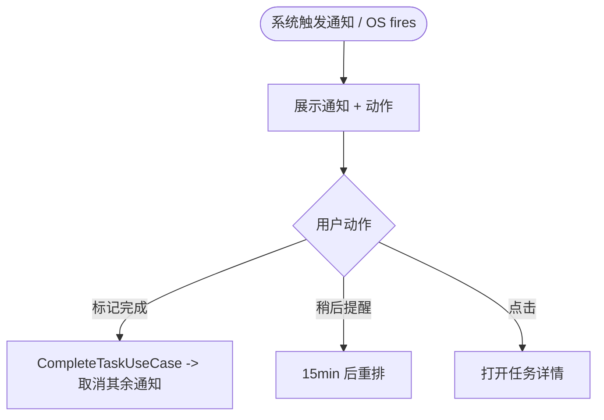

# 05 · 通知模块 / Notification Module

> 关联 / Related: [README](README.md) · [02 任务](02-task-module.md) · [06 平台](06-platform-settings-sync.md) · [需求 §3.4](../doc/proposal.md)

---

## 1. 职责 / Responsibility

**中文：** 计算任务的提醒触发时间（截止前/开始时/自定义/逾期），将其调度到操作系统通知；处理免打扰、通知动作（标记完成/稍后提醒）、应用被杀后的后台触发，以及任务变更时的提醒重排与取消。领域计算（纯函数）与平台实现（`INotificationService`）分离。

**English:** Computes reminder trigger times (before due / at start / custom / overdue), schedules OS notifications, handles DND, notification actions (mark done / snooze), background firing after app kill, and reschedule/cancel on task changes. Pure-function domain calc is separated from the platform impl behind `INotificationService`.

---

## 2. 领域：提醒计算 / Domain: Reminder Calculator

**中文：** 纯函数。输入任务 + 用户设置，输出绝对触发时间列表。无 IO，易测。

```dart
// features/notification/domain/reminder_calculator.dart
class ReminderCalculator {
  /// 由任务的提醒配置 + 全局设置算出绝对触发点
  List<Reminder> compute(Task task, AppSettings settings) {
    final out = <Reminder>[];
    for (final r in task.reminders) {
      switch (r.type) {
        case ReminderType.beforeDue:
          if (task.dueDate == null) continue;
          out.add(r.copyWith(
            triggerAt: task.dueDate!.subtract(Duration(minutes: r.offsetMin ?? settings.defaultAdvanceMin)),
          ));
        case ReminderType.atStart:
          if (task.startDate == null) continue;
          out.add(r.copyWith(triggerAt: task.startDate!));
        case ReminderType.custom:
          out.add(r); // triggerAt 已是绝对时间
        case ReminderType.overdue:
          if (task.dueDate == null) continue;
          out.add(r.copyWith(triggerAt: task.dueDate!)); // 首次；后续由重复逻辑续推
      }
    }
    // 过滤过去时间（除逾期）/ drop past triggers except overdue
    final now = DateTime.now().toUtc();
    return out.where((r) => r.type == ReminderType.overdue || r.triggerAt.isAfter(now)).toList();
  }

  /// 逾期重复：基于间隔生成下一次逾期提醒
  DateTime? nextOverdue(DateTime lastFired, AppSettings settings) =>
      settings.overdueRepeatHours == 0 ? null
          : lastFired.add(Duration(hours: settings.overdueRepeatHours));
}
```

| 触发类型 / Type | 触发时间 / Trigger | 默认 / Default |
|---|---|---|
| `beforeDue` | `due - offset` | 提前 15 分钟 |
| `atStart` | `start` | 默认关闭 |
| `custom` | 用户绝对时间 | 按设定 |
| `overdue` | `due` 起，每 N 小时 | 24h（0=关闭） |

---

## 3. 平台契约 / Platform Contract

```dart
// core/contracts/i_notification_service.dart
abstract interface class INotificationService {
  Future<bool> requestPermission();
  Future<void> schedule(NotificationRequest req);
  Future<void> cancel(int notificationId);
  Future<void> cancelForTask(String taskId);
  Future<List<int>> pending();
  Stream<NotificationAction> get onAction;
}

@freezed
class NotificationRequest with _$NotificationRequest {
  const factory NotificationRequest({
    required int id,            // 平台通知 id（由 reminderId 派生稳定 hash）
    required String taskId,
    required DateTime when,     // 绝对触发 (UTC)
    required String title,
    required String body,
    @Default(true) bool allowActions,
  }) = _NotificationRequest;
}

@freezed
class NotificationAction with _$NotificationAction {
  const factory NotificationAction({
    required String taskId,
    required NotificationActionType type, // markDone | snooze | open
  }) = _NotificationAction;
}
```

---

## 4. 调度编排 / Scheduling Orchestrator

**中文：** 连接领域计算、提醒仓储与平台服务。任务写操作后由 02 的用例调用 `ReminderScheduler.sync(task)`，保证模块边界（02 不直接碰平台）。

```dart
// features/notification/application/reminder_scheduler.dart
class ReminderScheduler {
  ReminderScheduler(this._calc, this._reminders, this._notif, this._settings);

  /// 任务创建/更新后重排其全部提醒
  Future<void> sync(Task task) async {
    await _notif.cancelForTask(task.id);                 // 先清旧
    if (!_settings.current.notificationsEnabled) return;

    final reminders = _calc.compute(task, _settings.current);
    await _reminders.replaceForTask(task.id, reminders); // 持久化绝对时间

    for (final r in reminders) {
      if (_isInDnd(r.triggerAt) && r.type != ReminderType.overdue) continue;
      await _notif.schedule(NotificationRequest(
        id: r.notifId ?? _stableId(r.id),
        taskId: task.id,
        when: r.triggerAt,
        title: task.title,
        body: _composeBody(task),     // “[项目] · 截止 MM-dd HH:mm”
      ));
    }
  }

  /// 任务完成/删除后取消
  Future<void> cancel(String taskId) => _notif.cancelForTask(taskId);
}
```

通知正文模板（需求 §3.4.2）：`[项目名] · 截止 MM-dd HH:mm`，动作：标记完成 / 稍后提醒(15min)。

---

## 5. 动作处理 / Action Handling

```dart
// 监听平台通知动作 -> 调用 02 用例
ref.listen(notificationActionStreamProvider, (_, action) async {
  switch (action.type) {
    case NotificationActionType.markDone:
      await ref.read(completeTaskUseCaseProvider).call(action.taskId);
    case NotificationActionType.snooze:
      await ref.read(snoozeReminderUseCaseProvider).call(action.taskId, const Duration(minutes: 15));
    case NotificationActionType.open:
      ref.read(routerProvider).go('/task/${action.taskId}');
  }
});
```



---

## 6. 后台触发 / Background Firing

**中文：** 需求 §7.2 要求应用被杀后仍可提醒。采用**操作系统级定时通知**（提前把绝对时间交给系统），而非依赖应用进程常驻。

| 平台 / Platform | 实现 / Implementation |
|---|---|
| Android | `flutter_local_notifications` `zonedSchedule` + `AndroidScheduleMode.exactAllowWhileIdle`；需 `SCHEDULE_EXACT_ALARM`/`USE_EXACT_ALARM` 权限 (Android 12+) |
| Windows | 本地通知插件（Windows Toast / `local_notifier`）+ 计划任务；进程未运行的兜底见下 |
| 兜底 / Fallback | 启动时 `reconcile()`：对比 `reminders` 表与系统 pending，补调度遗漏、清理已完成 |

```dart
// 启动对账 / startup reconcile
Future<void> reconcileOnLaunch() async {
  final due = await _reminders.dueBefore(DateTime.now().toUtc().add(const Duration(days: 30)));
  final pending = (await _notif.pending()).toSet();
  for (final r in due) {
    if (!pending.contains(_stableId(r.id))) await _scheduleOne(r);
  }
}
```

逾期重复提醒在每次应用前台/后台唤醒或通知触发后，由 `nextOverdue` 续推下一次（避免一次排太多）。

---

## 7. 免打扰 / Do-Not-Disturb

```dart
bool _isInDnd(DateTime utc) {
  final s = _settings.current;
  if (!s.dndEnabled) return false;
  final local = utc.toLocal();
  return TimeRange(s.dndStart, s.dndEnd).contains(TimeOfDay.fromDateTime(local));
}
```

- DND 时段内**跳过推送**；逾期提醒可配置是否豁免（需求 §3.4.5）。
- 设置项见 [06 模块](06-platform-settings-sync.md)：全局开关、默认提前量、逾期间隔、DND 时段。

---

## 8. 权限与降级 / Permissions & Degradation

| 场景 / Scenario | 处理 / Handling |
|---|---|
| 未授权通知 | 首次进入引导 `requestPermission()`；拒绝则设置页提示 |
| Android 精确闹钟被拒 | 降级为 `inexactAllowWhileIdle`（需求风险缓解）+ 提示可能有延迟 |
| Windows 通知不可用 | 应用内提醒横幅兜底 |

---

## 9. ID 稳定性 / ID Stability

平台通知用 `int` id，本应用提醒用 `String`。用稳定哈希映射，确保取消/更新命中同一通知：

```dart
int _stableId(String reminderId) => reminderId.hashCode & 0x7fffffff;
```

冲突概率低；若担心，可在 `reminders.notif_id` 持久化分配的自增 int。

---

## 10. 测试策略 / Testing

| 层 / Layer | 测试 / Tests |
|---|---|
| 计算 / Calculator | 各类型触发时间正确；过去时间过滤；逾期续推；offset 默认值 |
| 调度 / Scheduler | `sync()` 先 cancel 再 schedule；DND 跳过；关闭通知时不调度（用 Spy `INotificationService`） |
| 动作 / Action | markDone 调用完成用例；snooze 重排 +15min |
| 对账 / Reconcile | 缺失的提醒被补调度 |
| 集成 / Integration | Fake 平台服务 + 内存库验证完整链路 |

```dart
test('sync cancels old then schedules computed reminders, skipping DND', () async {
  final notif = SpyNotificationService();
  final scheduler = ReminderScheduler(ReminderCalculator(), FakeReminderRepo(), notif, settingsWithDnd);
  await scheduler.sync(taskDueTonightInDnd);
  expect(notif.cancelledTaskIds, contains(task.id));
  expect(notif.scheduled, isEmpty); // 落在 DND
});
```
