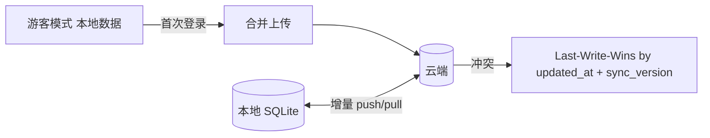
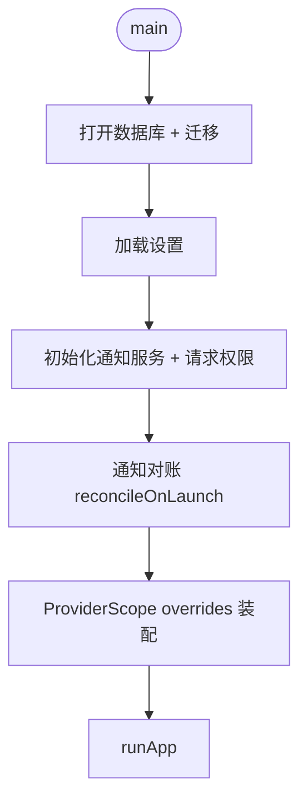

# 06 · 平台 / 设置 / 国际化 / 同步预留 / Platform · Settings · i18n · Sync

> 关联 / Related: [README](README.md) · [00 架构](00-architecture-overview.md) · [需求 §2.3 §2.4 §7.4 §7.5](../doc/proposal.md)

---

## 1. 职责 / Responsibility

**中文：** 承载跨模块的横切能力：应用设置（通知、主题、外观、DND）、主题系统、国际化、平台服务抽象（自适应布局、文件路径、后台调度），以及 Phase 2 云同步的预留接口与数据结构。

**English:** Cross-cutting concerns: app settings (notifications, theme, appearance, DND), theming, i18n, platform-service abstractions (adaptive layout, file paths, background scheduler), and reserved interfaces/data for Phase 2 cloud sync.

---

## 2. 设置 / Settings

### 2.1 模型 / Model

```dart
@freezed
class AppSettings with _$AppSettings {
  const factory AppSettings({
    // 通知 / notifications
    @Default(true) bool notificationsEnabled,
    @Default(15) int defaultAdvanceMin,       // 默认提前提醒
    @Default(24) int overdueRepeatHours,      // 0 = 关闭
    @Default(false) bool dndEnabled,
    @Default(TimeOfDayData(22, 0)) TimeOfDayData dndStart,
    @Default(TimeOfDayData(8, 0)) TimeOfDayData dndEnd,
    @Default(false) bool overdueIgnoresDnd,
    // 外观 / appearance
    @Default(ThemeModeData.system) ThemeModeData themeMode,
    @Default(BarColorMode.priority) BarColorMode barColorMode, // 甘特条配色
    @Default(LocaleData.system) LocaleData locale,
    // 行为 / behavior
    @Default(TaskSort.dueAsc) TaskSort defaultSort,
    @Default(CalendarViewType.week) CalendarViewType defaultCalendarView,
  }) = _AppSettings;
}
```

### 2.2 存储契约 / Store Contract

```dart
// core/contracts/i_settings_store.dart
abstract interface class ISettingsStore {
  AppSettings get current;
  Future<void> update(AppSettings Function(AppSettings) mutate);
  Stream<AppSettings> watch();
}
```

实现 `SharedPrefsSettingsStore`（`shared_preferences`，JSON 序列化），轻量、跨平台。设置变化通过 `watch()` 流驱动主题、语言、通知重排（监听 settings 的 Provider 触发 `ReminderScheduler` 全量重排）。

---

## 3. 主题 / Theming

```dart
@riverpod
ThemeData appLightTheme(ref) => _build(Brightness.light, ref.watch(seedColorProvider));
@riverpod
ThemeData appDarkTheme(ref) => _build(Brightness.dark, ref.watch(seedColorProvider));

ThemeData _build(Brightness b, Color seed) => ThemeData(
      useMaterial3: true,
      colorScheme: ColorScheme.fromSeed(seedColor: seed, brightness: b),
    );
```

- Material 3，浅/深/跟随系统（需求 §5.1）。
- 语义色（优先级红/橙/绿、完成灰、主色蓝）集中在 `core/theme/semantic_colors.dart`，供任务条/标记复用（需求 §5.5）。

---

## 4. 国际化 / i18n

- Flutter `gen-l10n` + ARB 文件：`l10n/app_zh.arb`、`l10n/app_en.arb`（需求 §7.5）。
- 所有用户可见字符串走 `AppLocalizations.of(context)`；领域错误用 `messageKey` 映射 ARB。
- 日期/数字按 locale 用 `intl` 格式化；时区转换在展示层完成（存储恒为 UTC）。

```
l10n/
├── app_en.arb      # { "taskOverdue": "Overdue", "dueBeforeStart": "Due date must be after start" }
├── app_zh.arb      # { "taskOverdue": "逾期", "dueBeforeStart": "截止日期不能早于开始日期" }
└── l10n.yaml
```

---

## 5. 平台服务抽象 / Platform Service Abstractions

```dart
/// 自适应断点 / adaptive breakpoints — 见 00 §4
abstract interface class ILayoutInfo {
  LayoutClass classOf(double width); // compact | medium | expanded
}

/// 文件与路径 / file & path
abstract interface class IFileService {
  Future<String> databasePath();
  Future<String> exportPath(String fileName);
}

/// 后台调度（通知对账等）/ background scheduler
abstract interface class IBackgroundScheduler {
  Future<void> registerPeriodic(String taskId, Duration interval);
}
```

| 服务 / Service | Android | Windows |
|---|---|---|
| 数据库路径 / DB path | `getApplicationSupportDirectory()` | `%APPDATA%/PlanList` |
| 后台调度 / Background | `WorkManager` | 启动对账 + 系统计划通知（无常驻进程） |
| 通知 / Notification | `flutter_local_notifications` | Windows Toast 插件 |

**桌面/移动差异集中在 `platform/`**，上层只用接口；保证 02–05 模块代码两端复用（需求 §1.2 一致体验）。

---

## 6. 同步预留 / Sync (Phase 2 Reserved)

**中文：** Phase 1 不实现云后端，但数据层已预留同步字段（见 [01 §3.2](01-data-and-persistence.md)），并定义接口，使 Phase 2 接入不改业务逻辑（需求 §2.3）。

### 6.1 接口 / Interface

```dart
// core/contracts/i_sync_engine.dart
abstract interface class ISyncEngine {
  Future<Result<void>> push();          // 上传本地变更
  Future<Result<void>> pull();          // 拉取远端变更
  Future<Result<void>> fullSync();
  Stream<SyncStatus> get status;        // idle | syncing | error | offline
}

abstract interface class IAuthService {  // 账号可选 (需求 §2.4)
  Future<Result<User>> signIn(Credentials c);
  Future<void> signOut();
  Stream<AuthState> get authState;       // guest | authenticated
}
```

### 6.2 策略（Phase 2 草案）/ Strategy (draft)



| 项 / Item | 决策（草案）/ Decision (draft) |
|---|---|
| 冲突解决 / Conflict | 基于 `updated_at` + `sync_version` 的 LWW；字段级合并为后续增强 |
| 删除 / Delete | 软删除 `deleted_at` 传播（tombstone） |
| 变更追踪 / Change tracking | `sync_version` 自增；本地维护 dirty 标记或 outbox 表 |
| 账号 / Account | 可选；游客数据首次登录合并（需求 §2.4） |
| 传输 / Transport | HTTPS + 可选 E2E 加密（需求 §7.3） |

> 这些是**预留**，Phase 1 仅保证字段与接口存在；`syncEngineProvider` 在 Phase 1 注入空实现（no-op）。

---

## 7. 应用启动序列 / App Startup Sequence



---

## 8. 测试策略 / Testing

| 层 / Layer | 测试 / Tests |
|---|---|
| 设置 / Settings | `update()` 持久化 + `watch()` 推送；默认值 |
| 主题 / Theme | seed 生成浅/深 ColorScheme |
| i18n | 关键 key 在 zh/en 均存在（ARB 完整性测试） |
| 同步 / Sync | Phase 1 no-op 实现不报错；预留接口可被 Fake 替换 |
