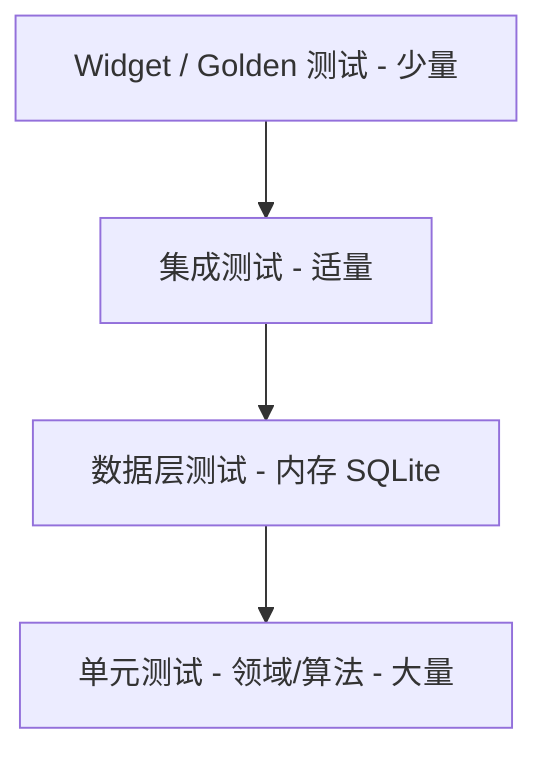

# 07 · 测试策略 / Testing Strategy

> 关联 / Related: [README](README.md) · [00 架构](00-architecture-overview.md) · 各模块文档的「测试策略」小节

---

## 1. 目标 / Goals

**中文：** 模块独立性意味着每个模块可在不启动其他模块的情况下被测试。所有跨模块依赖都是 `core/contracts` 接口，可用 Fake/Mock 替换。本文件统一测试分层、命名、Mock 契约与 CI。

**English:** Module independence means each module is testable without booting others. All cross-module dependencies are `core/contracts` interfaces, replaceable by Fakes/Mocks. This doc unifies test layers, naming, mock contracts, and CI.

---

## 2. 测试金字塔 / Test Pyramid



| 层 / Layer | 范围 / Scope | 工具 / Tools | 占比 / Share |
|---|---|---|---|
| 单元 / Unit | 领域实体、用例、纯算法（重复引擎、布局、提醒计算、分词） | `flutter_test`, `mocktail` | ~60% |
| 数据 / Data | DAO、Repository、Mapper、查询编译器、FTS | `drift` + `NativeDatabase.memory()` | ~20% |
| 集成 / Integration | 用例→仓储→DB→通知 全链路（Fake 平台） | `ProviderContainer` + Fakes | ~12% |
| Widget/Golden | 关键组件多状态、拖拽手势 | `flutter_test`, `golden_toolkit` | ~8% |

---

## 3. 模块隔离方式 / Module Isolation

**中文：** 用 Riverpod `overrides` 注入 Fake 契约实现，任何上层模块测试都不触达真实 DB/平台。

```dart
ProviderContainer makeContainer({
  ITaskRepository? tasks,
  INotificationService? notif,
  DateTime? now,
}) {
  return ProviderContainer(overrides: [
    taskRepositoryProvider.overrideWithValue(tasks ?? FakeTaskRepository()),
    notificationServiceProvider.overrideWithValue(notif ?? SpyNotificationService()),
    clockProvider.overrideWithValue(now ?? DateTime.utc(2026, 6, 7, 9)),
  ]);
}
```

### 标准 Fakes / Standard Fakes（`test/fakes/`）

| Fake | 替代 / Replaces | 能力 / Capability |
|---|---|---|
| `FakeTaskRepository` | `ITaskRepository` | 内存 List + `StreamController` 模拟 `watch` |
| `FakeReminderRepository` | `IReminderRepository` | 内存提醒存储 |
| `SpyNotificationService` | `INotificationService` | 记录 `scheduled` / `cancelledTaskIds`，可注入动作流 |
| `FakeSettingsStore` | `ISettingsStore` | 内存设置 + 可控 DND |
| `FakeSyncEngine` | `ISyncEngine` | no-op，验证调用 |

> 注入 `clockProvider`（可控时钟）是关键：让「逾期」「截止前提醒」「重复下一次」全部可确定性测试。

---

## 4. 各模块关键测试清单 / Per-Module Test Checklist

| 模块 / Module | 必测用例 / Must-test |
|---|---|
| 01 数据 | Mapper 往返；区间查询交集；FTS 触发器同步；迁移 v1→vN；软删除隐藏 |
| 02 任务 | 重复引擎各频率+月底边界；完成→取消通知→生成实例顺序；子任务自动完成；日期校验 |
| 03 日历 | 行分配重叠；`TimeAxis` 像素↔日期往返；Resize 越界回弹不写库；视图切换保持 anchor |
| 04 搜索 | 组合 AND；2-gram 分词；防抖只触发一次；空状态 |
| 05 通知 | 触发时间计算；DND 跳过；sync 先 cancel 后 schedule；动作映射；对账补调度 |
| 06 平台 | 设置持久化+流；主题生成；ARB key 完整性；同步 no-op |

---

## 5. 测试数据构建 / Test Data Builders

```dart
// test/builders/task_builder.dart
Task aTask({
  String? id,
  bool completed = false,
  DateTime? due,
  DateTime? start,
  RecurrenceRule? recurrence,
}) =>
    Task(
      id: id ?? 'task-${_seq++}',
      title: 'Test',
      createdAt: DateTime.utc(2026, 6, 1),
      startDate: start,
      dueDate: due,
      isCompleted: completed,
      recurrence: recurrence,
    );
```

使用 Builder 模式减少样板，提升可读性与可维护性。

---

## 6. 示例：跨模块集成测试 / Example: Cross-Module Integration

```dart
test('create task schedules reminder and shows in calendar range', () async {
  final db = AppDatabase(NativeDatabase.memory());
  final notif = SpyNotificationService();
  final container = ProviderContainer(overrides: [
    appDatabaseProvider.overrideWithValue(db),
    taskRepositoryProvider.overrideWithValue(DriftTaskRepository(db)),
    notificationServiceProvider.overrideWithValue(notif),
    clockProvider.overrideWithValue(DateTime.utc(2026, 6, 7, 9)),
  ]);

  await container.read(createTaskUseCaseProvider).call(
        TaskDraft(
          title: '写设计文档',
          startDate: DateTime.utc(2026, 6, 8),
          dueDate: DateTime.utc(2026, 6, 10, 17),
          reminders: const [ReminderDraft(type: ReminderType.beforeDue, offsetMin: 30)],
        ),
      );

  // 调度了提醒
  expect(notif.scheduled.single.when, DateTime.utc(2026, 6, 10, 16, 30));
  // 出现在日历区间
  final bars = await container.read(
    visibleBarsProvider(DateTimeRange(
      start: DateTime.utc(2026, 6, 7), end: DateTime.utc(2026, 6, 14),
    )).future,
  );
  expect(bars, hasLength(1));
});
```

---

## 7. CI 流水线 / CI Pipeline

```yaml
# .github/workflows/ci.yml (草案 / draft)
steps:
  - flutter pub get
  - dart run build_runner build --delete-conflicting-outputs   # drift/freezed/riverpod
  - dart format --output=none --set-exit-if-changed .
  - flutter analyze                                             # 含分层 import lint
  - flutter test --coverage
  - genhtml coverage/lcov.info -o coverage/html               # 覆盖率报告
```

| 门禁 / Gate | 阈值 / Threshold |
|---|---|
| 领域层覆盖率 / Domain coverage | ≥ 90% |
| 数据层覆盖率 / Data coverage | ≥ 80% |
| 整体覆盖率 / Overall | ≥ 75% |
| 分层依赖违规 / Layer violations | 0（CI 失败） |

---

## 8. 性能与回归 / Performance & Regression

- 用 `integration_test` + 1000 条 seed 数据，断言月视图查询、列表滚动帧时间符合需求 §7.1。
- Golden 测试覆盖任务条三态（正常/逾期/完成）与桌面/移动两套布局，防 UI 回归。
- 迁移测试对每个 `schemaVersion` 跳变验证，防数据损坏。
