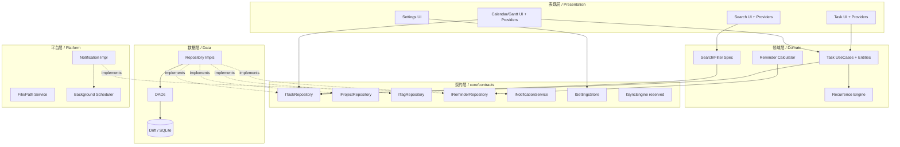

# 系统详细设计 / Detailed System Design

> **关联需求 / Source Requirements:** [`doc/proposal.md`](../doc/proposal.md)  
> **版本 / Version:** 0.1  
> **日期 / Date:** 2026-06-07  
> **技术栈 / Stack:** Flutter (Windows + Android), Drift/SQLite, Riverpod, go_router

---

## 1. 文档目的 / Purpose

**中文：** 本目录将需求文档拆解为可独立开发、独立测试的模块设计。每个模块文档包含：职责边界、对外接口契约（Dart 抽象）、数据契约、状态管理、关键算法与测试策略。模块之间只通过**抽象接口**通信，便于并行开发与替换实现。

**English:** This directory decomposes the requirements into modules that can be developed and tested independently. Each module doc defines responsibility boundaries, public interface contracts (Dart abstractions), data contracts, state management, key algorithms, and testing strategy. Modules communicate only through **abstract interfaces** to enable parallel development and implementation swapping.

---

## 2. 模块划分 / Module Breakdown

| # | 文档 / Document | 模块 / Module | 职责 / Responsibility |
|---|---|---|---|
| 00 | [00-architecture-overview.md](00-architecture-overview.md) | 架构总览 / Architecture | 分层、目录结构、DI、状态管理、路由、错误处理、模块契约总表 |
| 01 | [01-data-and-persistence.md](01-data-and-persistence.md) | 数据与持久化 / Data | Drift schema、DDL、DAO、Repository 实现、FTS5、迁移、同步字段 |
| 02 | [02-task-module.md](02-task-module.md) | 任务 / Task | 任务/子任务领域模型、用例、重复引擎、状态派生、Provider |
| 03 | [03-calendar-gantt-module.md](03-calendar-gantt-module.md) | 日历与甘特 / Calendar & Gantt | 视图模型、区间查询、布局算法、拖拽交互、日期数学 |
| 04 | [04-search-filter-module.md](04-search-filter-module.md) | 搜索与筛选 / Search & Filter | 查询规格、FTS、组合查询构建器、防抖、Provider |
| 05 | [05-notification-module.md](05-notification-module.md) | 通知 / Notification | 提醒计算、调度器、平台抽象、后台触发、免打扰、动作处理 |
| 06 | [06-platform-settings-sync.md](06-platform-settings-sync.md) | 平台/设置/同步 / Platform | 设置存储、主题、i18n、平台服务抽象、Phase 2 同步预留 |
| 07 | [07-testing-strategy.md](07-testing-strategy.md) | 测试策略 / Testing | 测试金字塔、模块隔离、Mock 契约、CI |

---

## 3. 模块依赖关系 / Module Dependency Graph

**中文：** 依赖单向向下。UI 模块（02–05 的表现层）依赖 `core/contracts` 中的抽象接口，而非 `data` 模块的具体实现。`data` 模块实现这些接口，在应用启动时通过 DI 注入。这样每个上层模块都可以在测试中用 Mock 替换 `data`。



**核心原则 / Core principle:** 表现层与领域层**永不** `import` `data` 或 `platform` 包；它们只 `import` `core/contracts`。依赖反转由 DI 容器在 `main()` 中装配。

---

## 4. 物理目录结构 / Physical Project Structure

```
lib/
├── main.dart                      # 入口 + DI 装配 / entry + DI wiring
├── app.dart                       # MaterialApp + 路由 / router
├── core/
│   ├── contracts/                 # 所有跨模块抽象接口 / cross-module interfaces
│   │   ├── i_task_repository.dart
│   │   ├── i_project_repository.dart
│   │   ├── i_tag_repository.dart
│   │   ├── i_reminder_repository.dart
│   │   ├── i_notification_service.dart
│   │   ├── i_settings_store.dart
│   │   └── i_sync_engine.dart
│   ├── models/                    # 纯领域实体 (无 IO) / pure domain entities
│   ├── enums/                     # Priority, TaskStatus, ReminderType...
│   ├── errors/                    # AppException 体系
│   ├── di/                        # Provider/GetIt 装配 / DI setup
│   └── utils/                     # date math, result type
├── data/
│   ├── db/                        # Drift database + tables + DAOs
│   ├── repositories/              # 实现 core/contracts / impls
│   └── mappers/                   # row <-> entity
├── features/
│   ├── task/                      # 02 模块 / module
│   ├── calendar/                  # 03 模块
│   ├── search/                    # 04 模块
│   ├── notification/              # 05 模块
│   └── settings/                  # 06 模块
├── platform/                      # 平台服务实现 / platform impls
└── l10n/                          # ARB i18n
test/
├── unit/                          # 领域/用例/算法 / domain & algorithms
├── data/                          # DAO/repo 用 in-memory sqlite
└── widget/                        # widget/golden tests
```

---

## 5. 阅读顺序建议 / Suggested Reading Order

1. **先读** [00-architecture-overview.md](00-architecture-overview.md) 理解分层与契约。
2. **再读** [01-data-and-persistence.md](01-data-and-persistence.md) 理解数据底座。
3. **按需读** 02–06 各功能模块。
4. **最后读** [07-testing-strategy.md](07-testing-strategy.md) 落实可测试性。

---

## 6. 约定 / Conventions

- **ID 策略 / IDs:** 所有实体主键为 `String`（UUID v4），便于 Phase 2 云同步全局唯一。
- **时间 / Time:** 内部统一用 UTC `DateTime` 存储（毫秒时间戳 INTEGER），UI 层按本地时区与 locale 渲染。
- **错误处理 / Errors:** 数据/领域层返回 `Result<T>`（成功/失败封装），不向上抛裸异常。
- **不可变 / Immutability:** 领域实体使用 `freezed` 不可变类 + `copyWith`。
- **命名 / Naming:** 接口以 `I` 前缀（`ITaskRepository`），实现以 `Drift`/`Impl` 后缀。
