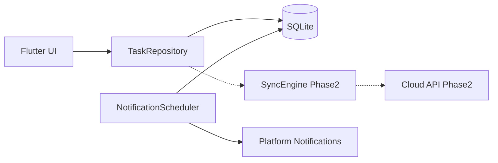
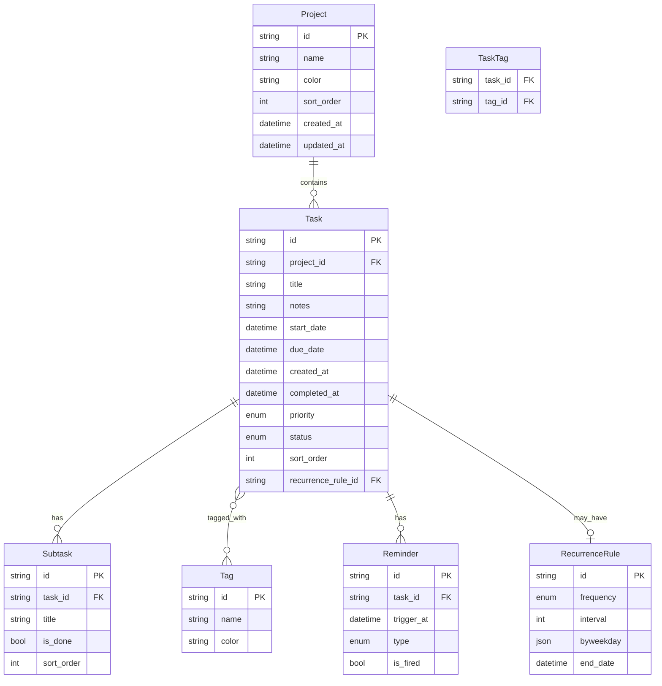
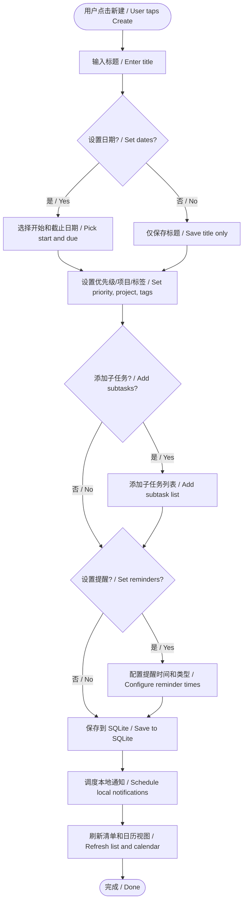
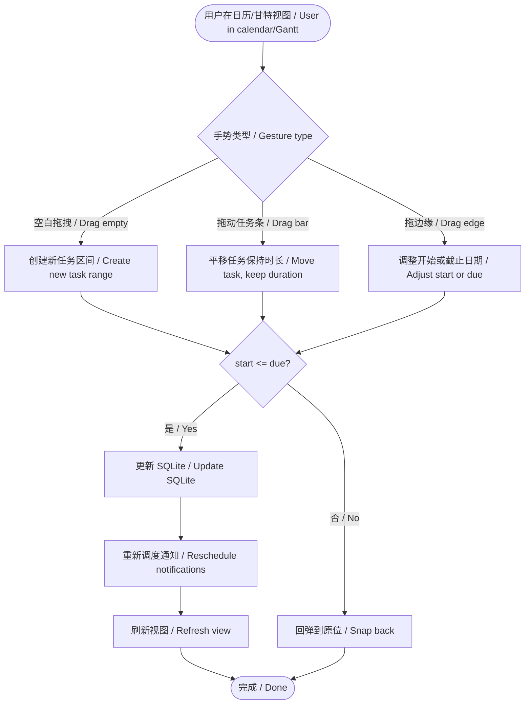
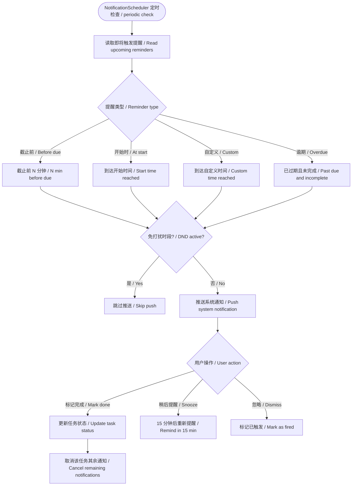
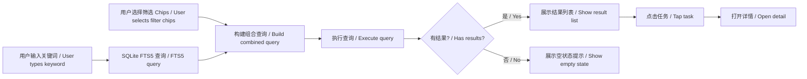
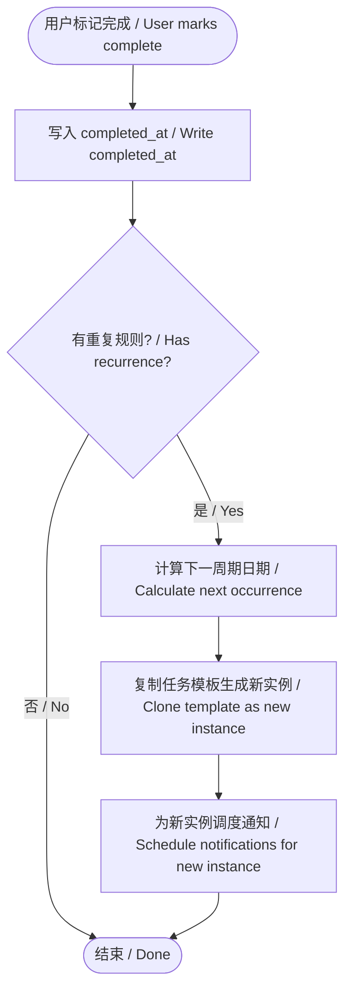
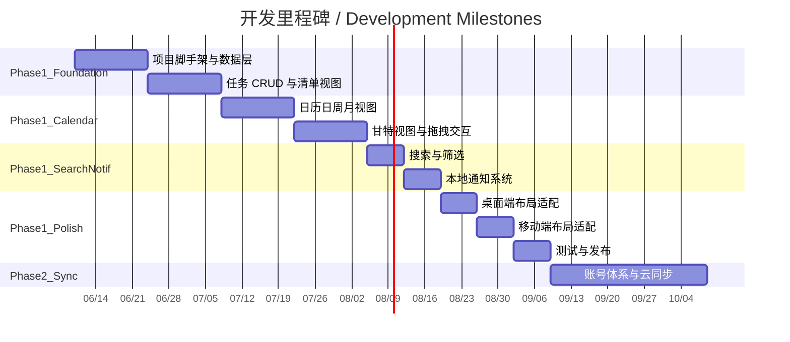

# 计划列表应用 — 产品需求文档 / Plan List App — Product Requirements Document

> **版本 / Version:** 0.1  
> **日期 / Date:** 2026-06-07  
> **状态 / Status:** 需求确认阶段 / Requirements Confirmed

---

## 目录 / Table of Contents

1. [概述与目标 / Overview & Goals](#1-概述与目标--overview--goals)
2. [平台与技术方案 / Platform & Technology](#2-平台与技术方案--platform--technology)
3. [功能需求 / Functional Requirements](#3-功能需求--functional-requirements)
4. [数据模型 / Data Model](#4-数据模型--data-model)
5. [界面原型想法 / UI Wireframe Ideas](#5-界面原型想法--ui-wireframe-ideas)
6. [用户交互流程 / User Flows](#6-用户交互流程--user-flows)
7. [非功能性需求与里程碑 / Non-Functional Requirements & Milestones](#7-非功能性需求与里程碑--non-functional-requirements--milestones)

---

## 1. 概述与目标 / Overview & Goals

### 1.1 产品定位 / Product Positioning

**中文：** 一款面向个人与轻量团队的任务计划应用，对标滴答清单（TickTick）与 Todoist 的核心体验。用户可创建带时间跨度的任务，在日历与甘特视图中规划日程，通过搜索筛选快速定位任务，并在关键节点收到本地通知提醒。

**English:** A personal and lightweight team task-planning app inspired by TickTick and Todoist. Users create time-bounded tasks, plan schedules in calendar and Gantt views, locate tasks via search and filters, and receive local notifications at key moments.

### 1.2 核心目标 / Core Goals


| 目标 / Goal                            | 说明 / Description                                                                          |
| ------------------------------------ | ----------------------------------------------------------------------------------------- |
| 跨平台一致体验 / Cross-platform consistency | 一套代码同时支持 Windows 桌面与 Android 移动端 / Single codebase for Windows desktop and Android mobile |
| 本地优先 / Local-first                   | 离线可用，数据存于本地 SQLite；可选云同步 / Offline-capable with local SQLite; optional cloud sync         |
| 时间可视化 / Time visualization           | 任务以「开始日期 ~ 截止日期」区间展示，支持甘特图 / Tasks shown as start–due ranges with Gantt support           |
| 高效检索 / Efficient retrieval           | 全文搜索 + 多维度筛选 / Full-text search plus multi-dimensional filters                            |
| 及时提醒 / Timely reminders              | 截止前、开始时、自定义时间、逾期等场景推送通知 / Notifications for due, start, custom, and overdue events        |


### 1.3 范围说明 / Scope Notes

**纳入范围 / In Scope（第一阶段 / Phase 1）：**

- 计划清单（任务 CRUD、属性、子任务、重复规则）
- 计划日历（日 / 周 / 月 / 甘特视图，拖拽交互）
- 搜索与筛选
- 本地通知
- Windows + Android 双端

**明确排除 / Explicitly Out of Scope：**

- ~~番茄钟 / Pomodoro timer~~（需求确认阶段已取消 / Removed during requirements gathering）
- 每日定时汇总推送 / Daily summary push notifications
- 保存常用筛选条件（智能清单）/ Saved filter presets (smart lists)
- 独立「计划日期」字段 / Separate "plan date" field
- 第一阶段不含完整云后端实现（仅预留架构）/ Full cloud backend not in Phase 1 (architecture reserved only)

---

## 2. 平台与技术方案 / Platform & Technology

### 2.1 平台策略 / Platform Strategy


| 维度 / Dimension             | 决策 / Decision                                                             |
| -------------------------- | ------------------------------------------------------------------------- |
| 跨平台方案 / Cross-platform     | **Flutter** — 单代码库 / Single codebase                                      |
| 第一阶段平台 / Phase 1 platforms | **Windows 桌面** + **Android 手机**                                           |
| 数据存储 / Data storage        | **SQLite**（本地优先 / local-first）                                            |
| 账号体系 / Account system      | **可选** — 不登录可用，登录后可同步 / Optional — usable without login; sync after login |
| 云同步 / Cloud sync           | **预留接口**，第一阶段以本地为主 / **Reserved**; Phase 1 is local-only                  |


### 2.2 技术栈推荐 / Recommended Tech Stack

```
┌─────────────────────────────────────────────────────────┐
│                    Flutter UI Layer                      │
│         (Material 3, adaptive layout desktop/mobile)   │
├─────────────────────────────────────────────────────────┤
│              State Management (Riverpod / Bloc)          │
├─────────────────────────────────────────────────────────┤
│           Domain Layer (Use Cases, Entities)             │
├─────────────────────────────────────────────────────────┤
│    Data Layer: SQLite (drift/sqflite) + Repository       │
│    Sync Layer (Phase 2+): REST/GraphQL + conflict rules  │
├─────────────────────────────────────────────────────────┤
│    Platform Services: local notifications, file system   │
└─────────────────────────────────────────────────────────┘
```

**关键依赖建议 / Key dependency suggestions：**


| 用途 / Purpose                       | 推荐 / Recommendation                                                                       |
| ---------------------------------- | ----------------------------------------------------------------------------------------- |
| 本地数据库 / Local DB                   | `drift`（类型安全 SQLite ORM）/ type-safe SQLite ORM                                            |
| 状态管理 / State management            | `flutter_riverpod` 或 `flutter_bloc`                                                       |
| 本地通知 / Local notifications         | `flutter_local_notifications`                                                             |
| 日历/甘特渲染 / Calendar/Gantt rendering | 自研 CustomPainter 或 `syncfusion_flutter_calendar`（评估授权）/ Custom widget or licensed library |
| 国际化 / i18n                         | Flutter built-in `intl` + ARB files                                                       |
| 路由 / Routing                       | `go_router`                                                                               |


### 2.3 本地优先与同步架构 / Local-First & Sync Architecture

**中文：** 所有读写先落本地 SQLite，UI 即时响应。云同步作为可选模块，通过 Repository 抽象层隔离，便于 Phase 2 接入而不改动业务逻辑。

**English:** All reads/writes go to local SQLite first for instant UI response. Cloud sync is an optional module isolated behind a Repository abstraction for Phase 2 integration without changing business logic.




### 2.4 账号模型 / Account Model


| 模式 / Mode             | 行为 / Behavior                                                       |
| --------------------- | ------------------------------------------------------------------- |
| 游客模式 / Guest mode     | 打开即用，数据仅存本机 / Open and use; data stays on device                    |
| 登录模式 / Logged-in mode | 绑定账号，启用跨设备同步（Phase 2+）/ Account-bound; cross-device sync (Phase 2+) |
| 数据迁移 / Data migration | 游客数据可在首次登录时合并上传 / Guest data mergeable on first login               |


---

## 3. 功能需求 / Functional Requirements

### 3.1 计划清单 / Task List

#### 3.1.1 任务基础字段 / Task Core Fields


| 字段 / Field          | 类型 / Type         | 用户填写 / User Input   | 说明 / Notes                                             |
| ------------------- | ----------------- | ------------------- | ------------------------------------------------------ |
| 标题 / Title          | String            | 必填 / Required       | 任务名称 / Task name                                       |
| 备注 / Notes          | String (Markdown) | 可选 / Optional       | 支持富文本或 Markdown / Rich text or Markdown                |
| 开始日期 / Start date   | DateTime          | 手动 / Manual         | 甘特条左端 / Gantt bar left edge                            |
| 截止日期 / Due date     | DateTime          | 手动 / Manual         | 甘特条右端；须 ≥ 开始日期 / Gantt bar right edge; must be ≥ start |
| 创建日期 / Created at   | DateTime          | 系统自动 / Auto         | 创建时写入 / Set on create                                  |
| 完成日期 / Completed at | DateTime          | 系统自动 / Auto         | 标记完成时写入 / Set on complete                              |
| 优先级 / Priority      | Enum              | 手动 / Manual         | 高 / 中 / 低 / High / Medium / Low                        |
| 状态 / Status         | Enum              | 系统+用户 / System+User | 未完成 / 已完成 / 逾期 / Incomplete / Complete / Overdue       |
| 所属项目 / Project      | FK                | 手动 / Manual         | 清单分组，如「工作」「生活」/ List grouping                          |
| 标签 / Tags           | M2M               | 手动 / Manual         | 多标签 / Multiple tags                                    |
| 重复规则 / Recurrence   | Object            | 可选 / Optional       | 每天 / 每周 / 每月 / 自定义 / Daily / Weekly / Monthly / Custom |
| 提醒时间 / Reminders    | List              | 可选 / Optional       | 可设多个自定义提醒 / Multiple custom reminders                  |


> **日期模型决策 / Date model decision：** 不设独立「计划日期」。任务的计划跨度由「开始日期 ~ 截止日期」区间表达，在甘特图与日历中渲染为一条横条。  
> No separate "plan date". The planned span is expressed as start–due range, rendered as a horizontal bar.

#### 3.1.2 子任务 / Subtasks

- 每个任务可包含 0~N 个子任务 / Each task may have 0–N subtasks
- 子任务字段：标题、完成状态、排序序号 / Fields: title, done flag, sort order
- 父任务完成逻辑：**所有子任务完成时，父任务可自动标记完成（可配置）** / When all subtasks done, parent may auto-complete (configurable)
- 子任务不参与甘特条渲染，但可在任务详情中展示进度（如 2/5）/ Subtasks not on Gantt; shown as progress in detail (e.g. 2/5)

#### 3.1.3 重复任务 / Recurring Tasks


| 规则 / Rule                     | 行为 / Behavior                                                             |
| ----------------------------- | ------------------------------------------------------------------------- |
| 完成当前实例 / Complete instance    | 生成下一周期实例，保留原模板 / Generate next instance from template                     |
| 修改单次 / Edit single occurrence | 仅影响当前实例或整个系列（用户选择）/ Affect this occurrence or entire series (user choice) |
| 删除 / Delete                   | 仅删除本次 / 删除整个系列 / Delete this / Delete all future                          |


#### 3.1.4 清单视图交互 / List View Interactions


| 操作 / Action           | 桌面端 / Desktop                              | 移动端 / Mobile                          |
| --------------------- | ------------------------------------------ | ------------------------------------- |
| 新建任务 / Create         | 顶部输入框 + Enter / Top input + Enter          | FAB 或底部输入 / FAB or bottom input       |
| 快速完成 / Quick complete | 点击复选框 / Click checkbox                     | 左滑或点击复选框 / Swipe or checkbox          |
| 编辑 / Edit             | 双击或右侧详情面板 / Double-click or side panel     | 点击进入全屏详情 / Tap for full-screen detail |
| 排序 / Sort             | 按截止日期、优先级、创建时间 / By due, priority, created | 同左 / Same                             |
| 批量操作 / Bulk actions   | 多选 + 批量完成/移动/删除 / Multi-select + bulk ops  | 长按进入多选模式 / Long-press multi-select    |


#### 3.1.5 验收标准 / Acceptance Criteria

- 用户可创建带开始/截止日期的任务，甘特视图正确渲染区间
- 创建/完成日期自动记录且不可手动篡改（只读展示）
- 子任务增删改及进度展示正常
- 重复任务完成後自动生成下一实例
- 逾期任务在列表中有视觉区分（如红色日期、逾期标签）

---

### 3.2 计划日历与甘特 / Calendar & Gantt

#### 3.2.1 视图类型 / View Types


| 视图 / View    | 描述 / Description                                               |
| ------------ | -------------------------------------------------------------- |
| 日视图 / Day    | 单日时间轴，按小时展示任务块 / Single-day timeline with hourly task blocks   |
| 周视图 / Week   | 7 列日历，每列一天 / 7-column calendar, one day per column             |
| 月视图 / Month  | 月历格子，任务以点或短条摘要显示 / Month grid with dots or short bar summaries |
| 甘特视图 / Gantt | 横向时间轴，任务为区间横条 / Horizontal timeline with task range bars       |


#### 3.2.2 甘特图渲染规则 / Gantt Rendering Rules

- 横轴：时间（日/周/月粒度随缩放变化）/ X-axis: time (day/week/month granularity on zoom)
- 纵轴：任务行（可按项目分组折叠）/ Y-axis: task rows (grouped by project, collapsible)
- 每个任务渲染为 `[开始日期, 截止日期]` 闭区间横条 / Each task rendered as closed interval bar
- 仅设截止日期、未设开始日期：开始日期默认等于截止日期（单日任务）/ Due only, no start: start defaults to due (single-day task)
- 颜色编码：优先级或项目色 / Color by priority or project color
- 逾期条：红色边框或半透明遮罩 / Overdue: red border or dim overlay

#### 3.2.3 拖拽交互 / Drag Interactions


| 手势 / Gesture                   | 效果 / Effect                                                |
| ------------------------------ | ---------------------------------------------------------- |
| 空白区域拖拽 / Drag on empty area    | 创建新任务，拖拽跨度即开始~截止日期 / Create task; drag span sets start–due |
| 拖动任务条 / Drag task bar          | 整体平移，保持原时长 / Move bar; preserve duration                   |
| 拖动左/右边缘 / Drag left/right edge | 调整开始或截止日期 / Adjust start or due date                       |
| 点击任务条 / Tap task bar           | 打开任务详情 / Open task detail                                  |


**约束 / Constraints：**

- 调整后 `start_date <= due_date` 始终成立 / Always enforce start_date ≤ due_date
- 移动端：长按进入拖拽模式，避免与滚动冲突 / Mobile: long-press to enter drag mode to avoid scroll conflict
- 桌面端：直接拖拽，支持吸附到天边界 / Desktop: direct drag with snap-to-day

#### 3.2.4 视图切换 / View Switching

- 顶部 Tab 或 Segmented Control：日 | 周 | 月 | 甘特 / Top tabs: Day | Week | Month | Gantt
- 左右箭头或滑动手势切换时间窗口 / Arrows or swipe to shift time window
- 「今天」按钮快速回到当前日期 / "Today" button jumps to current date

#### 3.2.5 验收标准 / Acceptance Criteria

- 四种视图均可正确展示任务
- 甘特条长度与起止日期一致
- 拖拽创建、移动、调整边缘三种操作均可用
- 视图切换后选中日期/时间窗口保持一致

---

### 3.3 搜索与筛选 / Search & Filter

#### 3.3.1 全文搜索 / Full-Text Search

- 搜索范围：任务标题 + 备注 / Scope: title + notes
- 实时搜索（输入即过滤）/ Real-time search as user types
- 高亮匹配关键词 / Highlight matched keywords
- 本地 SQLite FTS5 索引 / Local SQLite FTS5 index

#### 3.3.2 筛选维度 / Filter Dimensions


| 筛选项 / Filter   | 选项 / Options                                                         |
| -------------- | -------------------------------------------------------------------- |
| 日期 / Date      | 今天 / 本周 / 本月 / 自定义范围 / Today / This week / This month / Custom range |
| 状态 / Status    | 全部 / 未完成 / 已完成 / 逾期 / All / Incomplete / Complete / Overdue          |
| 优先级 / Priority | 高 / 中 / 低 / 全部 / High / Medium / Low / All                           |
| 标签 / Tags      | 多选 / Multi-select                                                    |
| 项目 / Project   | 单选或多选 / Single or multi-select                                       |


- 搜索与筛选可组合（AND 逻辑）/ Search and filters combinable (AND logic)
- 不提供「保存筛选条件 / 智能清单」功能（Phase 1）/ No saved filter presets in Phase 1

#### 3.3.3 验收标准 / Acceptance Criteria

- 输入关键词后 300ms 内返回结果
- 多筛选条件组合结果正确
- 空结果时有友好提示 / Friendly empty-state message

---

### 3.4 通知 / Notifications

#### 3.4.1 触发场景 / Trigger Scenarios


| 场景 / Scenario           | 触发条件 / Trigger Condition                  | 默认行为 / Default                                             |
| ----------------------- | ----------------------------------------- | ---------------------------------------------------------- |
| 截止前提醒 / Before due      | 截止日期前 N 分钟/小时/天 / N min/hr/day before due | 默认提前 15 分钟 / Default 15 min before                         |
| 开始时提醒 / At start        | 到达开始日期时间 / When start datetime reached    | 默认关闭 / Off by default                                      |
| 自定义提醒 / Custom reminder | 用户为任务设的特定时间点 / User-set specific datetime | 按用户设定 / As user configured                                 |
| 逾期提醒 / Overdue          | 已过截止日期且未完成 / Past due and incomplete      | 逾期后每 24h 提醒一次（可配置）/ Every 24h after overdue (configurable) |


#### 3.4.2 通知内容 / Notification Content

```
标题 / Title:  [任务标题 / Task title]
正文 / Body:   [项目名] · [截止日期 MM-DD HH:mm] / [Project] · [Due date]
操作 / Actions: 标记完成 / 稍后提醒(15min) / Mark done · Snooze (15 min)
```

#### 3.4.3 平台差异 / Platform Differences


| 平台 / Platform | 实现 / Implementation                                                           |
| ------------- | ----------------------------------------------------------------------------- |
| Android       | `flutter_local_notifications` + 精确闹钟权限 (Android 12+) / exact alarm permission |
| Windows       | Windows Toast Notification API via plugin                                     |


#### 3.4.4 设置项 / Settings

- 全局通知开关 / Global notification toggle
- 默认提前提醒时间 / Default advance reminder duration
- 逾期重复提醒间隔 / Overdue repeat interval
- 免打扰时段 / Do-not-disturb hours

#### 3.4.5 验收标准 / Acceptance Criteria

- 四种触发场景均能准时推送（误差 < 1 分钟）
- 任务完成或删除后，关联通知自动取消
- 通知操作「标记完成」可从通知栏直接完成
- 免打扰时段内不推送（逾期除外，可配置）

---

## 4. 数据模型 / Data Model

### 4.1 实体关系图 / Entity-Relationship Diagram




### 4.2 枚举定义 / Enum Definitions

**Priority / 优先级**

```
HIGH   = 0   // 高 / High
MEDIUM = 1   // 中 / Medium
LOW    = 2   // 低 / Low
```

**TaskStatus / 任务状态**

```
INCOMPLETE = 0   // 未完成 / Incomplete
COMPLETE   = 1   // 已完成 / Complete
OVERDUE    = 2   // 逾期（派生状态，由定时任务计算）/ Overdue (derived, computed by scheduler)
```

**ReminderType / 提醒类型**

```
BEFORE_DUE = 0   // 截止前 / Before due
AT_START   = 1   // 开始时 / At start
CUSTOM     = 2   // 自定义 / Custom
OVERDUE    = 3   // 逾期 / Overdue
```

**RecurrenceFrequency / 重复频率**

```
DAILY   = 0
WEEKLY  = 1
MONTHLY = 2
CUSTOM  = 3
```

### 4.3 索引策略 / Index Strategy


| 索引 / Index         | 字段 / Fields    | 用途 / Purpose                      |
| ------------------ | -------------- | --------------------------------- |
| `idx_task_due`     | `due_date`     | 日历视图范围查询 / Calendar range queries |
| `idx_task_start`   | `start_date`   | 甘特视图范围查询 / Gantt range queries    |
| `idx_task_status`  | `status`       | 状态筛选 / Status filter              |
| `idx_task_project` | `project_id`   | 项目筛选 / Project filter             |
| `idx_task_fts`     | `title, notes` | 全文搜索 FTS5 / Full-text search      |


### 4.4 同步字段预留 / Sync Fields (Reserved)

Phase 2 云同步时，各实体增加：

```
sync_id        : UUID globally unique
updated_at     : last modification timestamp
deleted_at     : soft delete timestamp (nullable)
sync_version   : optimistic concurrency version
device_id      : originating device identifier
```

---

## 5. 界面原型想法 / UI Wireframe Ideas

### 5.1 设计原则 / Design Principles

- **Material 3** 设计体系，支持浅色/深色主题 / Material 3 with light/dark themes
- 桌面端：信息密度高，侧边栏 + 主内容区 / Desktop: high density, sidebar + main content
- 移动端：触控优先，底部导航 + 全屏视图 / Mobile: touch-first, bottom nav + full-screen views
- 任务条颜色：按项目色或优先级色，用户可在设置中切换 / Bar color by project or priority, switchable in settings

### 5.2 桌面端布局 / Desktop Layout (Windows)

```
┌──────────────────────────────────────────────────────────────────┐
│  [Logo]  PlanList          🔍 搜索...          ⚙ 设置  👤 账号   │
├────────────┬─────────────────────────────────────────────────────┤
│            │  [清单] [日历] [搜索]          ← 2026年6月 →  [今天] │
│  📁 项目   ├─────────────────────────────────────────────────────┤
│  ├ 工作    │  日 | 周 | 月 | 甘特                              │
│  ├ 生活    │  ┌─────────────────────────────────────────────┐   │
│  ├ 学习    │  │                                             │   │
│            │  │         日历 / 甘特 主视图区域                │   │
│  🏷 标签   │  │                                             │   │
│  ├ 紧急    │  │   ████████ 任务A (6/1 - 6/5)               │   │
│  ├ 阅读    │  │        ██████████ 任务B (6/3 - 6/10)       │   │
│            │  │                                             │   │
│  📋 筛选   │  └─────────────────────────────────────────────┘   │
│  ├ 今天    │                                                     │
│  ├ 逾期    │  ┌─ 任务详情面板（右侧，选中任务时展开）──────────┐   │
│  └ 已完成  │  │  标题: 完成需求文档                            │   │
│            │  │  开始: 2026-06-01  截止: 2026-06-05           │   │
│            │  │  优先级: 高  标签: 紧急                        │   │
│            │  │  ☐ 子任务1  ☐ 子任务2                         │   │
│            │  │  备注: ...                                     │   │
│            │  └───────────────────────────────────────────────┘   │
└────────────┴─────────────────────────────────────────────────────┘
```

**关键布局决策 / Key layout decisions：**

- 左侧边栏固定宽度 ~240px，可折叠 / Left sidebar ~240px, collapsible
- 主区域上方：视图切换 Tab + 日期导航 / Top of main area: view tabs + date navigation
- 选中任务时，右侧滑出详情面板（桌面不跳转页面）/ Task detail slides in from right on selection
- 甘特视图支持纵向滚动（任务行）和横向滚动（时间轴）/ Gantt: vertical scroll (rows) + horizontal scroll (timeline)

### 5.3 移动端布局 / Mobile Layout (Android)

```
┌─────────────────────────┐
│  PlanList        🔍  ⚙  │
├─────────────────────────┤
│                         │
│    主内容区              │
│    （清单 / 日历视图）    │
│                         │
│                         │
│                         │
│                         │
├─────────────────────────┤
│  📋清单  📅日历  🔍搜索  │
└─────────────────────────┘
         [+ FAB 新建任务]
```

**清单页 / List tab：**

```
┌─────────────────────────┐
│  工作 ▾     排序▾  筛选▾ │
├─────────────────────────┤
│  ☐ 完成需求文档    🔴 高  │
│     6/1 - 6/5  ·  2个子任务│
├─────────────────────────┤
│  ☑ 团队周会               │
│     已完成 · 6/3          │
├─────────────────────────┤
│  ☐ 阅读 Chapter 3   逾期  │
│     截止 6/1              │
└─────────────────────────┘
```

**日历页 / Calendar tab：**

- 默认周视图，顶部左右滑动切换周 / Default week view; swipe top to change week
- 点击日格进入日视图 / Tap day cell for day view
- 长按空白格拖拽创建任务 / Long-press empty cell and drag to create
- 底部上滑展开任务详情 Sheet / Swipe up bottom sheet for task detail

**搜索页 / Search tab：**

- 顶部搜索框 + 筛选 Chips（状态、优先级、标签、日期）/ Search bar + filter chips
- 结果列表与清单页卡片样式一致 / Results use same card style as list tab

### 5.4 任务详情页 / Task Detail Screen


| 区域 / Section     | 内容 / Content                                         |
| ---------------- | ---------------------------------------------------- |
| 标题区 / Header     | 标题（可编辑）、完成复选框 / Editable title, completion checkbox  |
| 日期区 / Dates      | 开始日期、截止日期（DatePicker）/ Start & due with DatePicker   |
| 属性区 / Attributes | 优先级、项目、标签 / Priority, project, tags                  |
| 子任务区 / Subtasks  | 可增删的子任务列表 / Add/remove subtask list                  |
| 提醒区 / Reminders  | 提醒时间列表 + 添加入口 / Reminder list + add button           |
| 重复区 / Recurrence | 重复规则设置 / Recurrence rule settings                    |
| 备注区 / Notes      | 多行文本 / Multi-line text                               |
| 元信息 / Meta       | 创建日期、完成日期（只读）/ Created & completed dates (read-only) |


### 5.5 色彩与图标 / Colors & Icons


| 语义 / Semantic          | 色值建议 / Suggested color               | 用途 / Usage                         |
| ---------------------- | ------------------------------------ | ---------------------------------- |
| 高优先级 / High priority   | `#E53935` (Red)                      | 优先级标记、逾期 / Priority badge, overdue |
| 中优先级 / Medium priority | `#FB8C00` (Orange)                   | 优先级标记 / Priority badge             |
| 低优先级 / Low priority    | `#43A047` (Green)                    | 优先级标记 / Priority badge             |
| 已完成 / Completed        | `#9E9E9E` (Grey)                     | 已完成任务文字 / Completed task text      |
| 主色 / Primary           | `#1976D2` (Blue)                     | 按钮、选中态 / Buttons, selected state   |
| 甘特条 / Gantt bar        | 项目色或优先级色 / Project or priority color | 任务条背景 / Task bar background        |


---

## 6. 用户交互流程 / User Flows

### 6.1 新建任务完整流程 / Create Task Flow




### 6.2 日历拖拽改期流程 / Calendar Drag-to-Reschedule Flow




### 6.3 通知触发与响应流程 / Notification Trigger & Response Flow




### 6.4 搜索筛选流程 / Search & Filter Flow




### 6.5 重复任务完成流程 / Recurring Task Completion Flow




---

## 7. 非功能性需求与里程碑 / Non-Functional Requirements & Milestones

### 7.1 性能 / Performance


| 指标 / Metric             | 目标 / Target                                      |
| ----------------------- | ------------------------------------------------ |
| 冷启动 / Cold start        | < 2 秒（Android mid-range / Windows SSD）           |
| 列表滚动 / List scroll      | 60 fps，1000 条任务无卡顿 / 60 fps with 1000 tasks      |
| 搜索响应 / Search latency   | 输入后 < 300ms 返回结果 / Results within 300ms of input |
| 日历范围查询 / Calendar query | 月视图加载 < 500ms / Month view loads in < 500ms      |
| 数据库大小 / DB size         | 10,000 任务 < 50MB / 10,000 tasks under 50MB       |


### 7.2 可靠性 / Reliability

- 所有写操作使用 SQLite 事务，保证原子性 / All writes use SQLite transactions for atomicity
- 应用崩溃不丢失已保存数据 / No data loss on crash for persisted data
- 通知调度在应用被杀后仍可触发（Android WorkManager / Windows Task Scheduler）/ Notifications fire after app kill via background scheduler

### 7.3 安全与隐私 / Security & Privacy

- Phase 1 数据仅存本机，不上传 / Phase 1 data stays on device only
- Phase 2 云同步使用 HTTPS + 端到端加密（可选）/ Phase 2 sync over HTTPS with optional E2E encryption
- 不收集用户行为分析（除非用户明确同意）/ No analytics without explicit consent

### 7.4 可访问性 / Accessibility

- 支持系统字体缩放 / Support system font scaling
- 任务状态不仅靠颜色区分，同时使用图标/文字 / Status conveyed by icon/text, not color alone
- 桌面端完整键盘导航支持 / Full keyboard navigation on desktop

### 7.5 国际化 / Internationalization

- Phase 1：中文 + 英文 / Phase 1: Chinese + English
- 日期格式跟随系统区域设置 / Date format follows system locale
- 所有 UI 字符串外置到 ARB 文件 / All UI strings in ARB files

### 7.6 开发里程碑 / Development Milestones




| 阶段 / Phase                      | 交付物 / Deliverables                                                                        | 预估周期 / Estimate   |
| ------------------------------- | ----------------------------------------------------------------------------------------- | ----------------- |
| **P1-A 基础 / Foundation**        | Flutter 项目、SQLite 模型、任务 CRUD、清单视图 / Project scaffold, SQLite models, task CRUD, list view | 2 周 / 2 weeks     |
| **P1-B 日历 / Calendar**          | 日/周/月视图、甘特视图、拖拽交互 / Day/week/month/Gantt views, drag interactions                         | 4 周 / 4 weeks     |
| **P1-C 搜索通知 / Search & Notify** | 全文搜索、筛选、本地通知 / Full-text search, filters, local notifications                             | 2 周 / 2 weeks     |
| **P1-D 打磨 / Polish**            | 双端 UI 适配、设置页、主题、测试 / Dual-platform UI, settings, themes, testing                          | 2 周 / 2 weeks     |
| **P2 云同步 / Cloud Sync**         | 账号体系、后端 API、冲突解决、跨设备同步 / Account, backend API, conflict resolution, sync                  | 4~6 周 / 4–6 weeks |


### 7.7 风险与缓解 / Risks & Mitigations


| 风险 / Risk                                                   | 影响 / Impact | 缓解 / Mitigation                                                                 |
| ----------------------------------------------------------- | ----------- | ------------------------------------------------------------------------------- |
| 甘特拖拽在移动端体验差 / Poor mobile Gantt drag UX                     | 高 / High    | 长按进入拖拽模式；提供替代方案（详情页改日期）/ Long-press drag mode; fallback via detail date pickers |
| Android 精确通知权限限制 / Android exact alarm restrictions         | 中 / Medium  | 引导用户授权；降级为近似提醒 / Guide user to grant permission; fallback to inexact alarms     |
| 重复任务边界情况复杂 / Recurring task edge cases                      | 中 / Medium  | Phase 1 仅支持常见规则（日/周/月）；复杂规则 Phase 2 / Phase 1: daily/weekly/monthly only        |
| Windows 通知 API 兼容性 / Windows notification API compatibility | 低 / Low     | 使用成熟 plugin；提供应用内提醒兜底 / Mature plugin; in-app reminder fallback                 |


---

## 附录 A：需求决策记录 / Appendix A: Decision Log


| #   | 议题 / Topic              | 决策 / Decision                                                                    | 日期 / Date  |
| --- | ----------------------- | -------------------------------------------------------------------------------- | ---------- |
| 1   | 跨平台方案 / Cross-platform  | Flutter 单代码库 / Flutter single codebase                                           | 2026-06-07 |
| 2   | 目标平台 / Target platforms | Windows + Android（第一阶段）/ Phase 1                                                 | 2026-06-07 |
| 3   | 数据存储 / Data storage     | 本地优先 SQLite，预留云同步 / Local-first SQLite, sync reserved                            | 2026-06-07 |
| 4   | 账号 / Account            | 可选，不登录可用 / Optional, usable without login                                        | 2026-06-07 |
| 5   | 日期模型 / Date model       | 开始+截止手动，创建+完成自动；无独立计划日期 / Manual start+due, auto created+completed; no plan date | 2026-06-07 |
| 6   | 番茄钟 / Pomodoro          | **取消 / Removed**                                                                 | 2026-06-07 |
| 7   | 日历视图 / Calendar views   | 日/周/月/甘特 + 拖拽交互 / Day/week/month/Gantt + drag                                    | 2026-06-07 |
| 8   | 智能清单 / Smart lists      | 不做 / Not in scope                                                                | 2026-06-07 |
| 9   | 通知 / Notifications      | 截止前/开始时/自定义/逾期；无每日汇总 / Before due, at start, custom, overdue; no daily summary   | 2026-06-07 |
| 10  | 文档语言 / Doc language     | 中英双语 / Bilingual                                                                 | 2026-06-07 |


---

## 附录 B：术语表 / Appendix B: Glossary


| 中文   | English         | 说明 / Description                                                 |
| ---- | --------------- | ---------------------------------------------------------------- |
| 计划清单 | Task List       | 任务的列表视图，支持 CRUD 和属性管理 / List view for task CRUD and attributes   |
| 甘特图  | Gantt Chart     | 以横条展示任务时间跨度的视图 / View showing task time spans as horizontal bars |
| 本地优先 | Local-first     | 数据先写本地，可选同步到云端 / Write locally first, optional cloud sync        |
| 子任务  | Subtask         | 任务下的检查项 / Checklist items under a task                           |
| 重复规则 | Recurrence Rule | 任务周期性重新生成的配置 / Configuration for periodic task regeneration      |
| 逾期   | Overdue         | 已过截止日期且未完成的任务 / Task past due date and not completed             |


---

*本文档将随需求迭代持续更新。下一步：确认本文档后，进入 Flutter 项目脚手架与数据层开发。*  
*This document will be updated as requirements evolve. Next step: after confirmation, proceed to Flutter project scaffold and data layer development.*