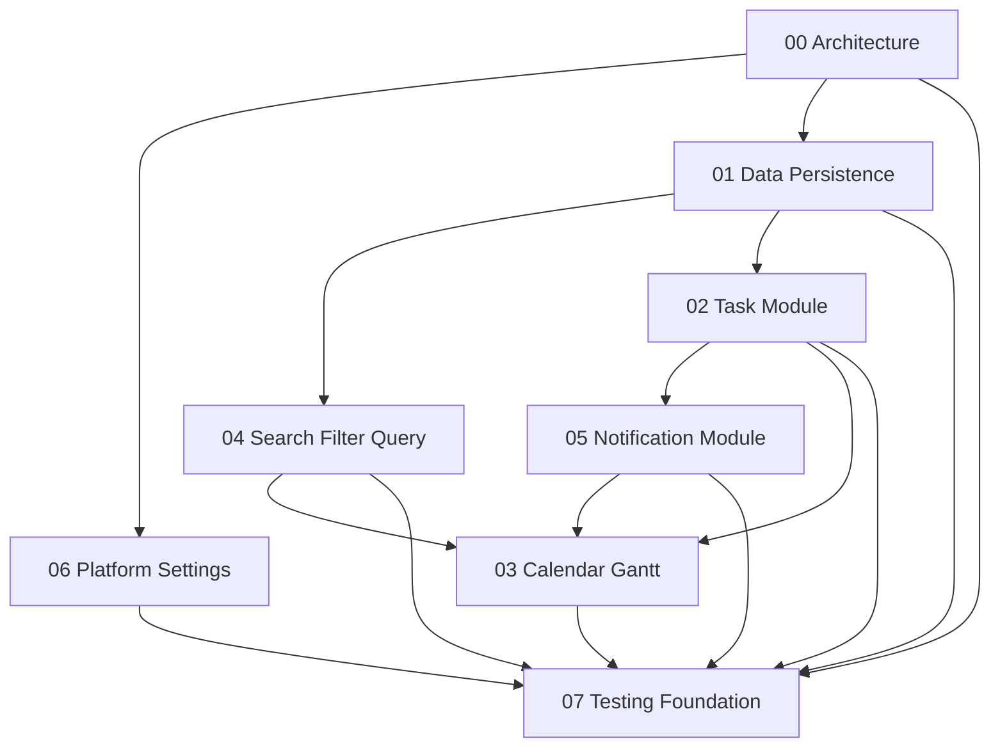

# 项目进度跟踪 / Project Progress

> Source: `design/`  
> Last updated: 2026-06-07  
> Overall status: ✅ Complete — all 8 modules implemented; 336 tests passing; 生产启动已装配（main.dart 注入真实 Drift/Settings/Notification/Sync）。可执行打包仅受环境前置项阻塞（见 §5）。

## 1. 总览 / Overview

本文件跟踪从详细设计到实现落地的整体进度。每个模块的详细任务清单位于 `tasks/` 目录，并使用 checklist 标记完成状态。

## 2. 模块进度 / Module Progress

| # | 模块 / Module | 任务清单 / Task List | 状态 / Status | 完成度 / Progress |
|---|---|---|---|---|
| 00 | 架构总览 / Architecture | [`tasks/architecture-overview.md`](tasks/architecture-overview.md) | ✅ Done | 100% |
| 01 | 数据与持久化 / Data & Persistence | [`tasks/data-and-persistence.md`](tasks/data-and-persistence.md) | ✅ Done | 100% |
| 02 | 任务模块 / Task | [`tasks/task-module.md`](tasks/task-module.md) | ✅ Done | 100% |
| 03 | 日历与甘特 / Calendar & Gantt | [`tasks/calendar-gantt-module.md`](tasks/calendar-gantt-module.md) | ✅ Done | 100% |
| 04 | 搜索与筛选 / Search & Filter | [`tasks/search-filter-module.md`](tasks/search-filter-module.md) | ✅ Done | 100% |
| 05 | 通知模块 / Notification | [`tasks/notification-module.md`](tasks/notification-module.md) | ✅ Done | 99% |
| 06 | 平台/设置/同步预留 / Platform, Settings & Sync | [`tasks/platform-settings-sync.md`](tasks/platform-settings-sync.md) | ✅ Done | 100% |
| 07 | 测试策略 / Testing | [`tasks/testing-strategy.md`](tasks/testing-strategy.md) | ✅ Done | 100% |

## 3. 推荐实施顺序 / Recommended Implementation Order

## 4. 里程碑 / Milestones

### M1 · 项目骨架与核心契约 / Project Scaffold & Core Contracts

- [x] 完成 `tasks/architecture-overview.md`
- [x] 完成基础路由、自适应布局、Provider override、错误处理与核心接口

### M2 · 本地数据底座 / Local Data Foundation

- [x] 完成 `tasks/data-and-persistence.md`
- [x] Drift/SQLite schema、DAO、Repository、FTS5、软删除可用

### M3 · 任务核心功能 / Task Core

- [x] 完成 `tasks/task-module.md`
- [x] 任务 CRUD、子任务、重复任务、清单视图、详情页可用

### M4 · 搜索筛选 / Search & Filter

- [x] 完成 `tasks/search-filter-module.md`
- [x] `TaskQuery`、FTS、筛选组合、防抖与搜索页可用

### M5 · 通知系统 / Notification System

- [x] 完成 `tasks/notification-module.md`
- [x] 截止前、开始时、自定义、逾期提醒与通知动作可用

### M6 · 日历与甘特 / Calendar & Gantt

- [x] 完成 `tasks/calendar-gantt-module.md`
- [x] 日/周/月/甘特视图与拖拽交互可用

### M7 · 平台设置与同步预留 / Platform, Settings & Sync Reserve

- [x] 完成 `tasks/platform-settings-sync.md`
- [x] 设置、主题、i18n、平台服务、同步 no-op 可用

### M8 · 测试与质量门禁 / Testing & Quality Gates

- [x] 完成 `tasks/testing-strategy.md`
- [x] 单元/数据/集成/Widget/Golden 测试与 CI 门禁可用

## 5. 当前阻塞 / Current Blockers

- [x] ~~尚未初始化 Flutter 项目代码。~~
- [x] ~~日历库选择~~ — 已按设计自研日/周/月/甘特渲染（M6 完成）。
- [x] ~~Windows 通知插件~~ — 已使用 `flutter_local_notifications`（M5 完成）。
- [x] ~~生产启动 wiring（main.dart 注入真实仓储/设置/通知/同步）~~ — 已完成，`flutter run`/打包后即用真实数据。
- [ ] **可执行打包（仅受本机环境前置项阻塞，需管理员操作一次）**：
  - Windows：① 开启「开发者模式」（`start ms-settings:developers` → 打开开关；插件 symlink 必需）；② 在 Visual Studio Installer 勾选 **「使用 C++ 的桌面开发」** 工作负载（含 *C++ CMake tools for Windows* 与 *Windows 10 SDK*）。完成后 `flutter build windows --release`。
  - Android：安装 Android SDK / 命令行工具（`flutter doctor` 提示），再 `flutter build apk --release`。
- [ ] 分层 import lint：`tool/check_layer_imports.sh` 已接入 CI（warn-only）；2 处已知跨层 import 待迁移后再启用 `--strict`。
- [ ] 覆盖率门禁：`tool/check_coverage.dart` 已接入 CI（warn-only）；当前 domain 84.8% / data 33.1% / overall 44.6%，低于目标阈值，需补测 presentation 层。
- [ ] M5 遗留：未授权通知提示 UI、逾期自动续推 hook。

### 工具链与质量 / Toolchain & Quality

- Flutter SDK：`C:\Users\WuChen\AppData\Local\flutter`（User PATH）。
- 全量门禁：`flutter analyze` 无问题；`flutter test` 共 **336** 项全部通过。
- 生产装配：`lib/main.dart` 通过 `ProviderScope.overrides` 注入 `AppDatabase(openConnection())`（Drift/SQLite，存于应用文档目录 `plan_list.sqlite`）、`SharedPrefsSettingsStore`、平台 `INotificationService`、`NoOpSyncEngine`；测试环境（`FLUTTER_TEST`）下跳过会阻塞的 `SharedPreferences.getInstance()`。
- Android 清单：已加 `POST_NOTIFICATIONS` / `SCHEDULE_EXACT_ALARM` / `USE_EXACT_ALARM` / `RECEIVE_BOOT_COMPLETED` 权限与 `flutter_local_notifications` 接收器。
- 本地化：`MaterialApp` 已挂载 `AppLocalizations` delegates，支持 en/zh，随系统区域。
- CI：`.github/workflows/ci.yml`（format → analyze → layer-import check → test --coverage → coverage summary）。
- 测试基础设施：`test/fakes/`（含 `makeContainer`）、`test/builders/`、集成测试、1000 任务性能冒烟测试。

## 6. 更新规则 / Update Rules

- 每完成一个任务文件中的 checklist 项，在对应文件中勾选。
- 每完成一个模块，更新本文件的状态与完成度。
- 若设计变更，先更新 `design/`，再同步调整对应 `tasks/` 文件。
- 若任务拆分过大，可在模块任务文件中追加子任务，不需要修改已完成项。
